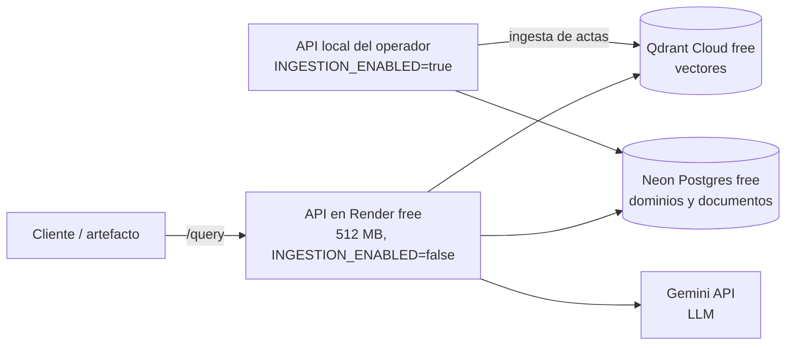

# Arquitectura de MIA

Documentación viva de cómo está implementado el sistema, para que cualquier desarrollador (humano o Claude Code) pueda orientarse sin releer todo el código. Se actualiza cada vez que cambia algo relevante de la arquitectura; para el "por qué" de las decisiones de alcance, ver [Definicion_Requerimientos_MVP.md](Definicion_Requerimientos_MVP.md). Para desplegar y operar el sistema, ver [OPERACION.md](OPERACION.md); para llevarlo a producción, [ESCALABILIDAD.md](ESCALABILIDAD.md).

## Concepto en una frase

Una API intermediaria (FastAPI) desacopla el almacenamiento (dominios de conocimiento en Qdrant + metadata en una base SQL) de los "artefactos" de consulta (chatbots, interfaces internas) que la usarán más adelante. Cada pieza del pipeline (loader de documentos, embeddings, LLM, base vectorial) es una interfaz intercambiable seleccionable por configuración, no código hardcodeado.

## Estructura del código

```
src/mia/
├── config.py          Settings (pydantic-settings, lee .env)
├── api/
│   ├── main.py         App FastAPI, arma los routers; en el lifespan: init_db() y ensure_collection()
│   └── routes/         health.py, domains.py, query.py
├── ingestion/
│   ├── loaders/        DocumentLoader (interfaz) + PdfLoader/DocxLoader/TxtLoader
│   ├── chunker.py      chunk_text(): split con overlap, sin dependencias externas
│   └── pipeline.py     ingest_document(): loader → chunker → embeddings → upsert
├── rag/
│   ├── embeddings.py    EmbeddingProvider (interfaz) + get_embedding_provider(name)
│   ├── llm.py           LLMProvider (interfaz) + get_llm_provider(name)
│   └── providers/       una implementación por proveedor (local, gemini, anthropic, openai)
└── storage/
    ├── db.py            engine/session de SQLAlchemy (SQLite en desarrollo, Postgres en producción)
    ├── models.py        Domain, Document (metadata)
    └── vector_store.py  VectorStore (interfaz) + QdrantVectorStore + get_vector_store()
```

## El patrón que se repite: interfaz + factory por nombre

`DocumentLoader`, `EmbeddingProvider`, `LLMProvider` y `VectorStore` siguen el mismo patrón: una clase abstracta define el contrato, cada implementación concreta vive en su propio archivo, y una función `get_x(name)` hace el dispatch leyendo `settings` (que a su vez lee `.env`). Para agregar un proveedor nuevo (otro LLM, otro loader), se agrega una clase que implemente la interfaz y una rama en el factory correspondiente; no se toca el resto del sistema. Este es el mecanismo concreto detrás del requerimiento de "poder cambiar partes del pipeline sin que interfiera con el resto" (sección 3 de Definicion_Requerimientos_MVP.md).

## Por qué una sola colección de Qdrant

`QdrantVectorStore` usa una única colección (`mia_chunks`) con `domain` como campo de payload filtrable, en lugar de una colección por dominio. Esto permite filtrar por uno o varios dominios en la misma consulta (necesario para casos de uso que cruzan dominios) y agregar dominios nuevos sin crear infraestructura nueva.

Trade-off aceptado: cambiar de modelo de embeddings con otra dimensionalidad requiere otra colección (o reindexar). Para evitar errores silenciosos, `ensure_collection()` falla al arrancar la API si la colección existente tiene una dimensión distinta a la del proveedor configurado, con un mensaje que indica cambiar `QDRANT_COLLECTION` o reindexar.

## Flujo de una consulta y de una ingesta

- **Ingesta** (`POST /domains/{id}/documents`): guarda el archivo en `uploads/`, crea el `Document` en estado `pending` (deduplicado por hash dentro del dominio) y dispara `ingest_document()` en segundo plano (`BackgroundTasks`). La ingesta procesa un documento a la vez (lock) y en lotes de 64 fragmentos, para acotar la memoria del modelo de embeddings. Estados: `pending → processing → done`/`error`. Se puede desactivar con `INGESTION_ENABLED=false` (responde 503); así está en Render, ver [OPERACION.md](OPERACION.md).
- **Consulta** (`POST /query`): embebe la pregunta, busca en Qdrant filtrando por dominio, descarta los resultados bajo `QUERY_SIMILARITY_THRESHOLD`, y si no queda ninguno responde "sin información suficiente" sin llamar al LLM. Si hay contexto, lo pasa al LLM con `RAG_SYSTEM_PROMPT` (`rag/llm.py`). Si el LLM responde la marca `SIN_INFORMACION` (ningún fragmento trata el tema), la API devuelve "sin información suficiente" sin fuentes; si no, devuelve la respuesta con las fuentes (nombre del documento y del dominio, leídos de la metadata SQL). El umbral solo filtra lo claramente ajeno: con actas reales, la similitud de preguntas con y sin respuesta se solapa (detalle en `specs/001-pipeline-ingesta-rag/research.md`).

## Qué funciona hoy vs. qué es interfaz sin implementar

**Funciona (probado con tests unitarios y manualmente contra Qdrant y Gemini reales):**
- CRUD básico de dominios y documentos (`/domains`, `/domains/{id}/documents`), con deduplicación por hash de archivo.
- `PdfLoader`, `DocxLoader`, `TxtLoader`: extracción real de texto (probado con actas reales en PDF de 96 a 180 páginas).
- `chunk_text()`: chunking con overlap (1000 caracteres, 200 de overlap).
- Metadata store con SQLAlchemy: SQLite en desarrollo, Postgres (Neon) en producción. Las tablas se crean al arrancar la API (`init_db()`); no hay migraciones (Alembic) todavía.
- `LocalEmbeddingProvider` (el que se usa): `intfloat/multilingual-e5-small` exportado a ONNX y cuantizado a int8 (`Xenova/multilingual-e5-small`), ejecutado con `onnxruntime` + `sentencepiece` en CPU, 384 dimensiones. Reemplazó a `sentence-transformers` (PyTorch), que ocupaba ~1.2 GB; con ONNX la API queda en ~340 MB en reposo. Los vectores son prácticamente iguales a los del modelo original (similitud coseno ~0.995). El Dockerfile descarga el modelo en el build y en ejecución se usa sin red (`HF_HUB_OFFLINE=1`).
- `GeminiEmbeddingProvider` (alternativa, no se usa en el despliegue actual): `gemini-embedding-001` a 768 dimensiones, en lotes de 100 y con reintentos ante límites por minuto. Su tier gratuito solo permite 1000 textos por día, insuficiente para ingerir actas (ver [ESCALABILIDAD.md](ESCALABILIDAD.md)). Usa otra colección de Qdrant por la dimensión distinta.
- `QdrantVectorStore.ensure_collection()` / `.upsert()` / `.search()`: colección bootstrapeada en el `lifespan`, con verificación de dimensión y filtro por dominio. `ensure_collection()` también crea índices de payload (`domain`, `document_id`) en cada arranque: Qdrant Cloud rechaza filtrar por un campo sin índice (el Qdrant local de desarrollo no lo exige, por eso no apareció en las pruebas locales).
- `AnthropicLLMProvider`: modelo fijo `claude-sonnet-5` (nunca `claude-opus-5`), esfuerzo configurable (`ANTHROPIC_EFFORT`, default `medium`).
- `GeminiLLMProvider` (el que se usa): modelo fijo `gemini-3.5-flash-lite` (tier gratuito de Google AI Studio, sin tarjeta), con timeout de 30 s y 3 intentos por consulta, porque en el tier gratuito el modelo responde a veces 503 ("high demand") y sin límite la consulta quedaba colgada. Ambos LLM quedan disponibles, se elige con `LLM_PROVIDER`, y comparten la instrucción de sistema `RAG_SYSTEM_PROMPT`.
- Los tests no dependen del `.env` de quien los corre: `tests/conftest.py` fija una base SQLite temporal y un Qdrant local antes de importar la configuración.
- `POST /query`: búsqueda semántica filtrada por dominio, umbral de similitud configurable (`QUERY_SIMILARITY_THRESHOLD`, calibración en `specs/001-pipeline-ingesta-rag/research.md`) y respuesta citando documento y dominio de origen.

**Interfaz definida, implementación pendiente (lanzan `NotImplementedError` a propósito, no es un bug):**
- `OpenAIEmbeddingProvider`, `OpenAILLMProvider`, `LocalLLMProvider` (LLM local, sigue esperando hardware propio).

Detalle completo de esta feature en `specs/001-pipeline-ingesta-rag/` (spec, plan, research, tasks). Cuando se implemente cualquiera de los pendientes de arriba, actualizar esta sección.

## Despliegue



- **Desarrollo local:** `docker-compose.yml` levanta Qdrant local + la API. Dentro de compose la API siempre usa el Qdrant de compose, aunque `.env` apunte a Qdrant Cloud.
- **Demo compartida (prototipo, costo cero):** API en Render free (`render.yaml`), metadata en Neon Postgres free, vectores en Qdrant Cloud free (región N. Virginia en AWS), LLM Gemini free. La API es la misma en todos los entornos; solo cambian las variables de entorno.
- **Ingesta en producción:** Render free tiene 512 MB y la ingesta de actas reales llega a 460-520 MB, así que allí está desactivada. Las actas se ingieren levantando la API en la máquina de quien opera, con `DATABASE_URL`, `QDRANT_URL` y `QDRANT_API_KEY` de producción: escribe en las mismas bases que lee Render. Pasos en [OPERACION.md](OPERACION.md).
- **Persistencia:** la metadata vive en Neon y los vectores en Qdrant Cloud, así que sobreviven a reinicios y redeploys de Render. Los archivos originales (`uploads/`) quedan solo en la máquina de quien ingirió; si se necesita reindexar, hay que tener los archivos.
