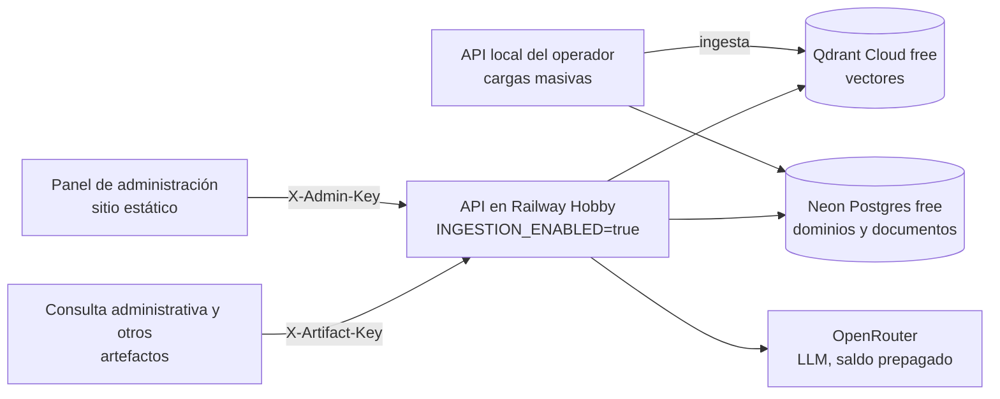

# Arquitectura de MIA

Documentación viva de cómo está implementado el sistema, para que cualquier desarrollador (humano o Claude Code) pueda orientarse sin releer todo el código. Se actualiza cada vez que cambia algo relevante de la arquitectura; para el "por qué" de las decisiones de alcance, ver [Definicion_Requerimientos_MVP.md](Definicion_Requerimientos_MVP.md). Para desplegar y operar el sistema, ver [OPERACION.md](OPERACION.md); para llevarlo a producción, [ESCALABILIDAD.md](ESCALABILIDAD.md).

## Concepto en una frase

Una API intermediaria (FastAPI) desacopla el almacenamiento (dominios de conocimiento en Qdrant + metadata en una base SQL) de los "artefactos" (aplicaciones web de consulta, chatbots, y el panel de administración que los gestiona). Cada artefacto de consulta se registra con su propia clave, y la API le aplica los dominios, modos y topes de gasto que se le permitieron. Cada pieza del pipeline (loader de documentos, embeddings, LLM, base vectorial) es una interfaz intercambiable seleccionable por configuración, no código hardcodeado.

## Estructura del código

```
src/mia/
├── config.py          Settings (pydantic-settings, lee .env)
├── api/
│   ├── main.py         App FastAPI, CORS y routers; en el lifespan: init_db() (migraciones) y ensure_collection()
│   ├── security.py     require_admin (X-Admin-Key) y require_artifact / optional_artifact (X-Artifact-Key)
│   └── routes/         health, inventory (árbol, unidades, carpetas), domains (dominios y documentos),
│                       artifacts, config, query (consulta y calificación), usage
├── access/             Lógica de acceso sin HTTP, para probarla sin levantar la API
│   ├── keys.py          generar, hashear y verificar claves
│   ├── permissions.py   dominios y modos que puede usar un artefacto
│   └── caps.py          topes diarios de gasto y su día (zona horaria de Costa Rica)
├── usage/              Módulo Uso
│   ├── aggregate.py     períodos, indicadores, series y tablas
│   ├── log.py           registro de consultas: listado, detalle y CSV
│   └── balance.py       saldo de OpenRouter
├── ingestion/
│   ├── loaders/        DocumentLoader (interfaz) + PdfLoader/DocxLoader/TxtLoader
│   ├── chunker.py      chunk_text(): split con overlap, sin dependencias externas
│   └── pipeline.py     ingest_document(): loader → chunker → embeddings → upsert
├── rag/
│   ├── embeddings.py    EmbeddingProvider (interfaz) + get_embedding_provider(name)
│   ├── llm.py           LLMProvider (interfaz), LLMAnswer (texto, tokens y costo) + get_llm_provider(name, model, effort)
│   ├── modes.py         modos de respuesta (literal, con razonamiento): proveedor, modelo y precios de cada uno
│   └── providers/       una implementación por proveedor (local, gemini, anthropic, openai, openrouter, glm)
└── storage/
    ├── db.py            engine/session de SQLAlchemy; init_db() aplica las migraciones de Alembic
    ├── models.py        Unit, Domain, Folder, Document, Artifact, ArtifactUnit, ArtifactDomain, QueryLog
    ├── migrations/      Alembic: 0001 (esquema anterior) y 0002 (panel de administración)
    └── vector_store.py  VectorStore (interfaz) + QdrantVectorStore + get_vector_store()

web/                    Aplicaciones web: admin/ (panel de administración) y consulta/ (Consulta administrativa)
web/admin/              Panel de administración (React + TypeScript + Vite), ver más abajo
web/consulta/           Consulta administrativa (React + TypeScript + Vite), ver más abajo
scripts/                cargar_carpeta.py, reorganizar_v2.py, pruebas_mvp.py, cliente.py
```

## Cómo se organiza la información

Tres niveles, más los documentos (especificación en [specs/002-panel-administracion/](../specs/002-panel-administracion/spec.md), decisiones en [Definicion_Requerimientos_V2.md](Definicion_Requerimientos_V2.md)):

- **Unidad académica** (`Unit`): agrupa dominios de un área, hoy Computación y Administración de Empresas. Es el nivel en que normalmente se da acceso a un artefacto.
- **Dominio** (`Domain`): lo que se elige al consultar (Memoria del Consejo, Currículum, Proyectos de graduación: Tesis...). Su nombre es único solo dentro de su unidad. Es la unidad de búsqueda y de permisos: Qdrant filtra por el id del dominio.
- **Carpeta** (`Folder`): agrupa documentos dentro de un dominio, anidable y sin límite de profundidad. **Solo organiza**: viven únicamente en la base SQL, la consulta sigue siendo por dominio, y crearlas o renombrarlas no obliga a reprocesar nada.
- **Documento** (`Document`): pertenece a un dominio y, opcionalmente, a una carpeta. El duplicado se detecta por contenido dentro del dominio, en cualquiera de sus carpetas.

Como Qdrant identifica cada dominio por su id y no por su nombre, renombrar un dominio o asignarle unidad no toca Qdrant. Mover documentos a otro dominio sí cambia el campo `domain` de sus fragmentos (`VectorStore.set_domain`), pero sin recalcular embeddings.

## Acceso: claves, permisos y modos

- **Clave de administración:** variable `ADMIN_KEY`, enviada en `X-Admin-Key`. Protege crear unidades, dominios y carpetas, subir documentos, gestionar artefactos y ver el módulo Uso. Sin `ADMIN_KEY` configurada esas operaciones responden 503, no quedan abiertas por olvido. Leer el inventario no la pide.
- **Artefactos** (`Artifact`): cada aplicación de consulta se registra con su nombre, una clave propia (`X-Artifact-Key`, generada por la API y mostrada una sola vez; se guarda solo su SHA-256), los dominios que puede consultar (todos, unidades completas incluidos sus dominios futuros, o dominios puntuales), los modos de respuesta permitidos y sus topes de gasto. Un mismo producto se registra una vez por público: las dos instancias de la Consulta administrativa (Postgrados Computación y Postgrados Administración Empresas) son dos artefactos.
- **Quién aplica los permisos:** la API, en cada consulta, no el artefacto (el código de un sitio estático se puede modificar). Una consulta a un dominio o modo no permitido, o de un artefacto desactivado, responde 403; un cambio hecho en el panel rige desde la consulta siguiente. `GET /domains` y `GET /config` con la clave de un artefacto muestran solo lo que ese artefacto puede usar.
- **Modos de respuesta** (`rag/modes.py`): `literal` y `razonamiento`. Cada uno tiene su proveedor, modelo y esfuerzo de razonamiento por configuración (`LLM_PROVIDER_<MODO>`, `LLM_MODEL_<MODO>`...); sin variables propias, el literal usa la configuración anterior (`LLM_PROVIDER`, `OPENROUTER_*`). Un modo sin proveedor figura como no disponible. Los artefactos piden un modo y nunca ven el modelo. Cada modo trae además su instrucción al modelo y su cantidad de resultados de búsqueda (`QUERY_SEARCH_LIMIT`, 8, en literal; `QUERY_SEARCH_LIMIT_RAZONAMIENTO`, 16, con razonamiento): la instrucción llega al proveedor como parámetro de `LLMProvider.answer`. La del literal pide responder solo con lo que dicen los fragmentos; la del razonamiento permite combinar, comparar, resumir y calcular, y estructura la respuesta en dos partes fijas ("Lo que dicen los documentos" y "Conclusión"). `POST /query` limita la pregunta a 2000 caracteres y devuelve `no_info` para que el cliente distinga la respuesta "sin información suficiente". Contrato en [specs/003-consulta-administrativa/contracts/api-consulta-modos.md](../specs/003-consulta-administrativa/contracts/api-consulta-modos.md).

## Registro de consultas, topes de gasto y Uso

- **Registro** (`QueryLog`): cada consulta queda guardada con su artefacto, pregunta, dominios, modo, modelo, tokens (de entrada, de salida y de razonamiento), costo en USD, tiempo, resultado (`answered`, `no_info`, `error`, `rejected_cap`, `rejected_permission`), fuentes citadas y calificación. También se registran las rechazadas, con costo cero. Las consultas sin clave válida (401) no se registran. El costo es el que informa OpenRouter en cada respuesta (`usage.cost`); si un proveedor no lo informa se estima con los precios configurados y se marca `cost_estimated`.
- **Topes diarios en USD** (`access/caps.py`): uno por artefacto (obligatorio, 0.50 USD por defecto), uno opcional menor para el modo con razonamiento, y uno de toda la API (`DAILY_CAP_USD`, solo por configuración, no editable desde el panel). Antes de cada consulta se compara el gasto de hoy, sumado sobre el registro, con los tres, en ese orden. Al alcanzar uno la API responde 429 con `Retry-After` hasta la medianoche de `CAP_TIMEZONE` (Costa Rica). El costo de una consulta se conoce al terminar, así que un tope puede excederse por lo que cuesten las consultas en curso; `OPENROUTER_MAX_TOKENS` acota ese exceso.
- **Uso** (`usage/`): indicadores con su comparación frente al período anterior, series por hora o día, tablas por artefacto y por modelo, registro con detalle y CSV, y el saldo de OpenRouter. Todo sale del registro de consultas. El CSV omite las preguntas salvo que se pidan, y neutraliza las celdas que parecen fórmulas. El saldo se lee de `GET /api/v1/key` (límite de crédito de la clave de MIA); con `OPENROUTER_MANAGEMENT_KEY`, que no se recomienda en producción, también del saldo de la cuenta, y se muestra el menor.

## Migraciones

El esquema lo versiona Alembic (`src/mia/storage/migrations/`). `init_db()` corre en cada arranque de la API: si la base ya tiene tablas pero no `alembic_version` (la de Neon, creada antes con `create_all`), la marca en la revisión `0001` sin ejecutarla, y luego aplica `0002`. Con una sola instancia de la API no hay riesgo de dos migraciones a la vez. `alembic upgrade head` también funciona desde la terminal, con `DATABASE_URL`. `domains.unit_id` es nullable en la base (los dominios anteriores a la reorganización no tienen unidad); la API la exige al crear uno.

## Panel de administración

`web/admin/`: React 19, TypeScript y Vite, con TanStack Query y `HashRouter` (funciona como sitio estático sin reescrituras). Un menú de módulos (`src/modules/index.tsx`): Inventario de información, Artefactos y accesos, y Uso; agregar uno es sumar una entrada y un grupo de rutas en la API. Las gráficas son SVG propio, con una paleta categórica validada para el modo claro y el oscuro. En desarrollo usa el proxy de Vite (`/api`); publicado como sitio estático llama directo a la API, que debe permitir su origen (`CORS_ORIGINS`). Detalle de uso en [web/admin/README.md](../web/admin/README.md).

## Consulta administrativa

`web/consulta/`: el artefacto de consulta para el personal administrativo (React 19, TypeScript y Vite, con TanStack Query y sin router: es una sola pantalla). Se abre con la clave de un artefacto; el nombre de la instancia, los dominios, los modos y los topes los da la API (`GET /config` y `GET /domains` con `X-Artifact-Key`), así que **una misma compilación se publica dos veces** (Computación y Administración de Empresas) y cada dirección recuerda su propia clave. No hay configuración por instancia en el código publicado.

- **Qué guarda el navegador:** solo la clave, la selección de dominios y el modo. La conversación no se guarda ni se envía de vuelta a la API: cada pregunta se responde por separado y las preguntas pueden tener datos personales.
- **Lógica sin interfaz** (`src/state/`, con pruebas de Vitest): qué modos mostrar y con cuál preguntar según `/config` (topes alcanzados, modo sin configurar), agrupación y recuerdo de dominios, mensajes y salidas ante cada error. Las respuestas se dibujan con un formateador propio (`src/format/`) que produce bloques de datos y no HTML, así que el texto del modelo nunca se interpreta como código de la página.
- **Errores y topes:** ante un 403 o un 429 la Consulta vuelve a pedir `/config` y `/domains` para actualizar modos, topes y dominios sin recargar; si el modo con razonamiento falla ofrece reintentar en literal.
- **Calificación:** `POST /query/{id}/feedback`, con comentario opcional; queda en el registro de consultas que ve el módulo Uso.
- **Compartir código con el panel:** no hay paquete compartido; cada sitio tiene su propio cliente de la API (unas 40 líneas parecidas) hasta que haya un tercero. Decisión en [specs/003-consulta-administrativa/research.md](../specs/003-consulta-administrativa/research.md).

Detalle de uso y publicación en [web/consulta/README.md](../web/consulta/README.md) y en [OPERACION.md](OPERACION.md).

## El patrón que se repite: interfaz + factory por nombre

`DocumentLoader`, `EmbeddingProvider`, `LLMProvider` y `VectorStore` siguen el mismo patrón: una clase abstracta define el contrato, cada implementación concreta vive en su propio archivo, y una función `get_x(name)` hace el dispatch leyendo `settings` (que a su vez lee `.env`). Para agregar un proveedor nuevo (otro LLM, otro loader), se agrega una clase que implemente la interfaz y una rama en el factory correspondiente; no se toca el resto del sistema. Este es el mecanismo concreto detrás del requerimiento de "poder cambiar partes del pipeline sin que interfiera con el resto" (sección 3 de Definicion_Requerimientos_MVP.md).

## Por qué una sola colección de Qdrant

`QdrantVectorStore` usa una única colección (`mia_chunks`) con `domain` como campo de payload filtrable, en lugar de una colección por dominio. Esto permite filtrar por uno o varios dominios en la misma consulta (necesario para casos de uso que cruzan dominios) y agregar dominios nuevos sin crear infraestructura nueva.

Trade-off aceptado: cambiar de modelo de embeddings con otra dimensionalidad requiere otra colección (o reindexar). Para evitar errores silenciosos, `ensure_collection()` falla al arrancar la API si la colección existente tiene una dimensión distinta a la del proveedor configurado, con un mensaje que indica cambiar `QDRANT_COLLECTION` o reindexar.

## Flujo de una consulta y de una ingesta

- **Ingesta** (`POST /domains/{id}/documents`, exige la clave de administración): acepta una carpeta de destino opcional y rechaza lo que supere `MAX_UPLOAD_MB` (413). Guarda el archivo en `uploads/`, crea el `Document` en estado `pending` (deduplicado por hash dentro del dominio, en cualquier carpeta; si ya existía responde 200 con `already_existed`) y dispara `ingest_document()` en segundo plano (`BackgroundTasks`). La ingesta procesa un documento a la vez (lock) y en lotes de 64 fragmentos, para acotar la memoria del modelo de embeddings. Estados: `pending → processing → done`/`error`. Se puede desactivar con `INGESTION_ENABLED=false` (responde 503); así está en Render, ver [OPERACION.md](OPERACION.md).
- **Consulta** (`POST /query`, exige la clave de un artefacto activo): valida permisos y topes (ver arriba), registra la consulta, embebe la pregunta, busca en Qdrant filtrando por dominio, descarta los resultados bajo `QUERY_SIMILARITY_THRESHOLD`, y si no queda ninguno responde "sin información suficiente" sin llamar al LLM. Si hay resultados, `rag/context.py` les suma los `QUERY_CONTEXT_NEIGHBORS` fragmentos vecinos del mismo documento y une los consecutivos en pasajes continuos (quitando la superposición del chunker), para no cortar listas o secciones que ocupan varios fragmentos. Los pasajes se pasan al LLM con `RAG_SYSTEM_PROMPT` (`rag/llm.py`). Si el LLM responde la marca `SIN_INFORMACION` (ningún fragmento trata el tema), la API devuelve "sin información suficiente" sin fuentes; si no, devuelve la respuesta con las fuentes (nombre del documento y del dominio, leídos de la metadata SQL). El umbral solo filtra lo claramente ajeno: con actas reales, la similitud de preguntas con y sin respuesta se solapa (detalle en `specs/001-pipeline-ingesta-rag/research.md`).

## Clientes de prueba

El panel de administración y la Consulta administrativa (dos instancias) son los artefactos reales; los chatbots (web, WhatsApp vía Kapso) quedan para después. Para consultar la API sin pasar por ellos, todos con la clave de un artefacto (`--clave` o `MIA_ARTIFACT_KEY`) y fuera del paquete `mia`:

- **Swagger UI** (`/docs` de la API): para probar a mano, con los encabezados `X-Admin-Key` o `X-Artifact-Key`.
- **`scripts/cliente.py`:** cliente de terminal con menú de dominios y de modos. Solo usa la biblioteca estándar.
- **`web/consulta/`:** la Consulta administrativa (ver "Consulta administrativa" más abajo).

`scripts/pruebas_mvp.py` usa la misma API para las pruebas de aceptación ([PRUEBAS_MVP.md](PRUEBAS_MVP.md)).

## Qué funciona hoy vs. qué es interfaz sin implementar

**Funciona (probado con tests unitarios y manualmente contra Qdrant y Gemini reales):**
- Unidades, dominios, carpetas y documentos (`/units`, `/domains`, `/domains/{id}/folders`, `/domains/{id}/documents`, `/inventory`), con deduplicación por hash de archivo.
- `PdfLoader`, `DocxLoader`, `TxtLoader`: extracción real de texto (probado con actas reales en PDF de 96 a 180 páginas). `DocxLoader` lee párrafos y tablas en el orden del documento, una fila por línea con las celdas separadas por " | ": los programas de curso del TEC tienen casi todo su contenido en tablas (créditos, horas, requisitos, objetivos, evaluación), y leyendo solo párrafos se perdía (p. ej. 114 de 4936 caracteres en un programa de Ciberseguridad).
- `chunk_text()`: chunking con overlap (1000 caracteres, 200 de overlap).
- Metadata store con SQLAlchemy: SQLite en desarrollo, Postgres (Neon) en producción. El esquema se versiona con Alembic y se aplica al arrancar la API (`init_db()`); ver "Migraciones".
- `LocalEmbeddingProvider` (el que se usa): `intfloat/multilingual-e5-small` exportado a ONNX y cuantizado a int8 (`Xenova/multilingual-e5-small`), ejecutado con `onnxruntime` + `sentencepiece` en CPU, 384 dimensiones. Reemplazó a `sentence-transformers` (PyTorch), que ocupaba ~1.2 GB; con ONNX la API queda en ~340 MB en reposo. Los vectores son prácticamente iguales a los del modelo original (similitud coseno ~0.995). El Dockerfile descarga el modelo en el build y en ejecución se usa sin red (`HF_HUB_OFFLINE=1`).
- `GeminiEmbeddingProvider` (alternativa, no se usa en el despliegue actual): `gemini-embedding-001` a 768 dimensiones, en lotes de 100 y con reintentos ante límites por minuto. Su tier gratuito solo permite 1000 textos por día, insuficiente para ingerir actas (ver [ESCALABILIDAD.md](ESCALABILIDAD.md)). Usa otra colección de Qdrant por la dimensión distinta.
- `QdrantVectorStore.ensure_collection()` / `.upsert()` / `.search()`: colección bootstrapeada en el `lifespan`, con verificación de dimensión y filtro por dominio. `ensure_collection()` también crea índices de payload (`domain`, `document_id`) en cada arranque: Qdrant Cloud rechaza filtrar por un campo sin índice (el Qdrant local de desarrollo no lo exige, por eso no apareció en las pruebas locales).
- `AnthropicLLMProvider`: modelo fijo `claude-sonnet-5` (nunca `claude-opus-5`), esfuerzo configurable (`ANTHROPIC_EFFORT`, default `medium`).
- `GeminiLLMProvider` (el que se usa): modelo fijo `gemini-3.5-flash-lite` (tier gratuito de Google AI Studio, sin tarjeta), con timeout de 30 s y 3 intentos por consulta, porque en el tier gratuito el modelo responde a veces 503 ("high demand") y sin límite la consulta quedaba colgada. Ambos LLM quedan disponibles, se elige con `LLM_PROVIDER`, y comparten la instrucción de sistema `RAG_SYSTEM_PROMPT`.
- Los tests no dependen del `.env` de quien los corre: `tests/conftest.py` fija una base SQLite temporal y un Qdrant local antes de importar la configuración.
- `POST /query` (con clave de artefacto, `mode` opcional): búsqueda semántica filtrada por dominio, umbral de similitud configurable (`QUERY_SIMILARITY_THRESHOLD`, calibración en `specs/001-pipeline-ingesta-rag/research.md`) y respuesta citando documento y dominio de origen. Al contexto del LLM se suman los fragmentos vecinos de cada resultado (`QUERY_CONTEXT_NEIGHBORS`), y los documentos cortos, de hasta `QUERY_FULL_DOCUMENT_MAX_CHUNKS` fragmentos (12 por defecto), se pasan completos: una lista que ocupa casi todo un documento corto (p. ej. las líneas de TFG) no cabe en un fragmento y sus vecinos (`src/mia/rag/context.py`).

- `OpenRouterLLMProvider`: cualquier modelo de OpenRouter (el de cada modo, o `OPENROUTER_MODEL`), con el SDK de OpenAI apuntando a la API de OpenRouter, y devuelve tokens y costo reales de cada respuesta. Esfuerzo de razonamiento configurable (`OPENROUTER_REASONING_EFFORT`) y, en cada consulta, solo proveedores que no entrenan con los datos (más `OPENROUTER_ZDR` para exigir retención cero). Es el LLM previsto para el despliegue en Railway. Implementado con tests unitarios; falta probarlo contra la API real.
- `GLMLLMProvider`: modelo fijo `glm-5.3` de Z.ai, con el SDK de OpenAI apuntando a la API de Z.ai (compatible con la de OpenAI). Razonamiento configurable (`GLM_THINKING`, activado por defecto), timeout de 120 s por intento y 2 reintentos. Implementado con test unitario; falta probarlo contra la API real. Es el LLM previsto para el despliegue en Cloud Run.
- `INGESTION_SYNC=true` ingiere dentro de la petición de subida en vez de en segundo plano, para Cloud Run con cobro por petición (la CPU se frena al responder).

**Interfaz definida, implementación pendiente (lanzan `NotImplementedError` a propósito, no es un bug):**
- `OpenAIEmbeddingProvider`, `OpenAILLMProvider`, `LocalLLMProvider` (LLM local, sigue esperando hardware propio).

Detalle completo de esta feature en `specs/001-pipeline-ingesta-rag/` (spec, plan, research, tasks). Cuando se implemente cualquiera de los pendientes de arriba, actualizar esta sección.

## Despliegue



- **Desarrollo local:** `docker-compose.yml` levanta Qdrant local + la API. Dentro de compose la API siempre usa el Qdrant de compose, aunque `.env` apunte a Qdrant Cloud.
- **Producción (prototipo):** API en Railway Hobby (`railway.json`, `https://mia-main.up.railway.app`), metadata en Neon Postgres free, vectores en Qdrant Cloud free (región N. Virginia en AWS), LLM por OpenRouter con saldo prepagado. La API es la misma en todos los entornos; solo cambian las variables de entorno. Hasta el 2026-10-07 la API estuvo en Render free (`render.yaml`, hoy suspendido) con Gemini gratuito.
- **Sitios web:** el panel (`mia-panel`) y las dos Consultas (`mia-computacion` y `mia-administracion`) son servicios de Railway que sirven archivos estáticos desde el mismo proyecto. No hay auto-deploy: se despliegan a mano con `railway up -s <servicio>` (ver [OPERACION.md](OPERACION.md), "Desplegar cambios").
- **Consulta administrativa:** un servicio estático de Railway por instancia (`web/consulta/Dockerfile` y `web/consulta/railway.json`), apagable con *Remove* y encendible con *Redeploy*; ver [OPERACION.md](OPERACION.md).
- **Ingesta en producción:** en Railway no hay límite de 512 MB, así que la API ingiere en el propio servidor. Para cargas masivas también se puede levantar la API en la máquina de quien opera, con `DATABASE_URL`, `QDRANT_URL` y `QDRANT_API_KEY` de producción: escribe en las mismas bases que lee Railway. Pasos en [OPERACION.md](OPERACION.md). (En Render free, con 512 MB, la ingesta de actas llegaba a 460-520 MB y estaba desactivada.)
- **Railway (en producción desde 2026-10-07):** reemplazó a Render free (suspendido), con ingesta en el servidor y límite duro de gasto (`railway.json`, `deploy/railway/`); el LLM pasa a OpenRouter. Pasos en [OPERACION.md](OPERACION.md). Cloud Run quedó preparado pero descartado (`deploy/cloudrun/`).
- **Persistencia:** la metadata vive en Neon y los vectores en Qdrant Cloud, así que sobreviven a reinicios y redeploys de Render. Los archivos originales (`uploads/`) quedan solo en la máquina de quien ingirió; si se necesita reindexar, hay que tener los archivos.
