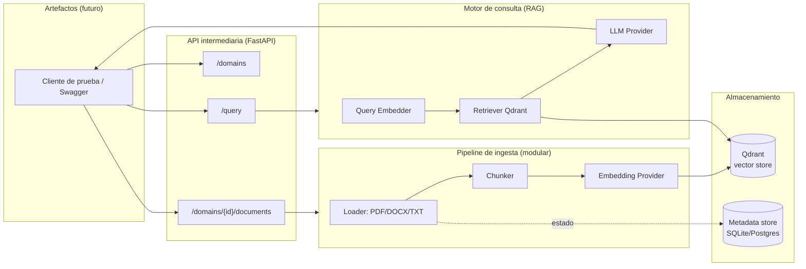

# MIA — Definición de Requerimientos y Diseño Técnico del MVP

**Qué es este documento:** traduce la definición conceptual de MIA (ver [Definicion_Conceptual_Prototipo.md](../../Digital_Transformation_Framework/docs/propuestas/Definicion_Conceptual_Prototipo.md) y [Prototipos_Seleccionados.md](../../Digital_Transformation_Framework/docs/propuestas/Prototipos_Seleccionados.md) en el repo `Digital_Transformation_Framework`) en requerimientos concretos y una arquitectura técnica para la primera versión implementable. Resuelve los puntos que quedaban pendientes en la sección 7 de esa definición, en lo que aplica al MVP.

## 1. Alcance del MVP

Decisiones tomadas para arrancar (2026-09-25):

| Decisión | Elegido | Por qué |
|---|---|---|
| Dominio(s) | **Memoria del Consejo** (solo actas) | Un único tipo de fuente, caso de uso claro y ya evidenciado (casos 1 y 6 del documento conceptual), valida el pipeline completo sin la complejidad de fuentes heterogéneas de Currículum ni la sensibilidad de datos de Docentes. |
| Artefacto | **Ninguno todavía** — solo API + cliente de prueba | Prioriza validar almacenamiento + RAG antes de invertir en UI de chat. La API queda diseñada para que cualquier artefacto futuro (Coordinación, WhatsApp, web) se conecte sin cambios en el backend. |
| Stack backend | **Python + FastAPI** | Ecosistema natural para RAG (loaders de PDF/DOCX, clientes de Qdrant, orquestación LLM), coherente con el benchmark de LLMs ya hecho en el objetivo específico 3. |
| LLM / embeddings | **Híbrido, configurable por variable de entorno** | Cumple el requerimiento explícito de "poder cambiar el LLM intermediario" y permite prototipar rápido con una API comercial mientras se valida migrar a un modelo local/auto-hospedado para producción (evitar depender de una API de pago, según sección 4 del documento conceptual). |

Quedan **fuera del MVP** (no bloquean el arranque, pero deben resolverse antes de exponer un artefacto real a usuarios):
- Control de acceso por artefacto/rol (sección 7 del documento conceptual).
- Métricas de éxito para evaluación con usuarios (objetivo específico 5).
- Dominios adicionales (Currículum, Apertura de promoción, Docentes, Proyectos de graduación).
- Ingesta vía web scraping (ACM) y CSV.
- Cualquier artefacto de chat (web, WhatsApp, interno).

## 2. Requerimientos funcionales del MVP

1. **Crear un dominio** con nombre y descripción (aunque el MVP solo use "Memoria del Consejo", la creación debe ser genérica desde el inicio — es requerimiento explícito del documento conceptual).
2. **Ingerir un documento** (PDF o DOCX de un acta) a un dominio existente, sin detener ni afectar el resto del sistema mientras se procesa.
3. **Consultar en lenguaje natural** indicando uno o más dominios a considerar, y recibir una respuesta generada por RAG con referencia a las fuentes (documento y fragmento) usadas.
4. **Listar dominios y documentos** existentes, con su estado de ingesta (pendiente / procesando / listo / error).
5. **Verificar salud del sistema** (endpoint de health check) para poder automatizar pruebas.

## 3. Requerimientos no funcionales

- **Idempotencia de ingesta:** volver a subir el mismo documento no debe duplicar información (deduplicar por hash del archivo).
- **Modularidad de pipeline:** cada etapa de ingesta (carga de archivo → chunking → embeddings → guardado en vectorial) debe ser una interfaz intercambiable, para poder añadir CSV o web scraping después sin tocar las demás etapas.
- **Intercambiabilidad del LLM/embeddings:** el proveedor de LLM y el de embeddings se seleccionan por configuración (variable de entorno), no por código hardcodeado.
- **Extensibilidad de dominios:** crear un dominio nuevo no debe requerir cambios de esquema ni despliegue distinto — es una operación de datos, no de código.
- **Idioma:** el contenido fuente (actas) y las consultas son en español; el modelo de embeddings y el LLM elegidos deben tener soporte sólido de español.
- **Reproducibilidad local:** todo el stack (API + base vectorial) debe levantar con un solo comando (`docker compose up`) para desarrollo y demo.
- **Trazabilidad:** toda respuesta del RAG debe poder citar de qué documento(s) y dominio(s) salió la información (requerido para que Coordinación confíe en la respuesta).

## 4. Arquitectura conceptual



**Por qué una API intermediaria única:** es el requerimiento explícito del documento conceptual — desacopla el Almacenamiento de los Artefactos, de modo que agregar un chatbot de WhatsApp o web más adelante no implica tocar el pipeline de ingesta ni el motor RAG, solo consumir la misma API.

## 5. Modelo de dominio (datos)

| Entidad | Campos clave | Dónde vive |
|---|---|---|
| **Domain** | `id`, `name`, `description`, `created_at` | Metadata store |
| **Document** | `id`, `domain_id`, `filename`, `source_type` (pdf/docx/txt), `file_hash`, `status`, `uploaded_at` | Metadata store |
| **Chunk** | `id`, `document_id`, `domain` (redundante, para filtrar), `text`, `chunk_index`, `embedding` | Qdrant (vector + payload) |

**Estrategia de colección en Qdrant:** una sola colección (`mia_chunks`) con `domain` como campo de payload filtrable, en lugar de una colección por dominio. Esto permite:
- Consultas multi-dominio nativas (caso de uso 6 del documento conceptual: "Currículum" + "Memoria del Consejo" a la vez) con un simple filtro `domain in [...]`.
- Agregar dominios nuevos sin crear infraestructura nueva — es solo un valor de payload distinto.

Trade-off aceptado: si en el futuro se cambia de modelo de embeddings con otra dimensionalidad, se necesita una migración o una colección nueva versionada — se documenta como riesgo conocido, no bloquea el MVP.

**Metadata store para el MVP:** SQLite vía SQLAlchemy (un archivo, cero infraestructura adicional). Migrable a Postgres cuando haya más de un dominio/artefacto en producción, sin cambiar el código de la capa de acceso a datos (se usa el ORM como frontera).

## 6. Contrato de la API (MVP)

| Método | Ruta | Descripción |
|---|---|---|
| `GET` | `/health` | Verifica que la API y Qdrant respondan. |
| `POST` | `/domains` | Crea un dominio. Body: `{name, description}`. |
| `GET` | `/domains` | Lista dominios. |
| `POST` | `/domains/{domain_id}/documents` | Sube un documento (multipart/form-data) y dispara su ingesta. |
| `GET` | `/domains/{domain_id}/documents` | Lista documentos del dominio con su `status`. |
| `POST` | `/query` | Body: `{domains: [id, ...], question: str}` → `{answer, sources: [{domain, document, excerpt}]}`. |

La documentación interactiva de FastAPI (`/docs`, Swagger UI) sirve como **cliente de prueba** para el MVP — cumple la decisión de no construir un artefacto de chat todavía.

## 7. Componentes modulares e interfaces de extensión

Para cumplir el requerimiento de "cambiar partes del pipeline sin que interfiera con el resto":

- **`DocumentLoader`** (interfaz): `PdfLoader`, `DocxLoader`, `TxtLoader` para el MVP. Extensible después a `CsvLoader`, `WebScraperLoader` (ACM) sin tocar el resto del pipeline.
- **`EmbeddingProvider`** (interfaz): implementación local (ej. modelo open-source vía `sentence-transformers` u Ollama) e implementación comercial (ej. OpenAI/Anthropic), seleccionable por `EMBEDDING_PROVIDER` en `.env`.
- **`LLMProvider`** (interfaz): mismo patrón que `EmbeddingProvider`, seleccionable por `LLM_PROVIDER` en `.env`. Este es el "LLM intermediario" mencionado en la definición conceptual.
- **`VectorStore`** (interfaz): implementación sobre Qdrant para el MVP; la interfaz existe para que cambiar de base vectorial en el futuro sea una implementación nueva, no un rediseño.

## 8. Stack tecnológico

- **Backend/API:** Python 3.12 + FastAPI + Uvicorn.
- **Base vectorial:** Qdrant (ya definida en el documento conceptual).
- **Metadata store:** SQLite + SQLAlchemy (MVP), migrable a Postgres.
- **Procesamiento de documentos:** `pypdf`/`pdfplumber` (PDF), `python-docx` (DOCX).
- **Orquestación RAG:** por definir en implementación — evaluar LangChain/LlamaIndex vs. implementación directa y ligera (a decidir al iniciar el código, no bloquea este documento).
- **Contenedores:** Docker + docker-compose (API + Qdrant, para desarrollo local).
- **Configuración:** variables de entorno vía `.env` (`pydantic-settings`).
- **Despliegue (demo compartida/producción):** API en [Render](https://render.com) (Blueprint `render.yaml`, plan free) + base vectorial en [Qdrant Cloud](https://cloud.qdrant.io) (clúster free tier), en vez de Railway. Decisión (2026-09-26): separar API y base vectorial en el proveedor gratuito que mejor ajusta a cada una, en lugar de forzar ambas al mismo proveedor (ver comparación de hosting en la conversación de definición del MVP). Trade-off aceptado: el servicio de Render en plan free se duerme tras 15 min sin tráfico (primera respuesta tarda 30-60s tras despertar); el clúster de Qdrant Cloud free se suspende tras 1 semana de inactividad.

## 9. Estructura de repositorio propuesta

```
MIA/
├── docs/
│   └── Definicion_Requerimientos_MVP.md   (este documento)
├── src/
│   └── mia/
│       ├── api/            # rutas FastAPI
│       ├── ingestion/      # loaders + chunker
│       ├── rag/            # embedding provider, llm provider, retriever
│       ├── storage/        # cliente Qdrant + modelos SQLAlchemy
│       └── config.py       # settings vía .env
├── tests/
├── docker-compose.yml
├── .env.example
└── pyproject.toml
```

## 10. Preguntas abiertas (no bloquean el MVP, pendientes antes de producción)

- **Control de acceso por artefacto/rol:** ¿la Consulta de Coordinación queda restringida a Coordinación/Consejo, o también accesible a Asistencia Administrativa? (sección 7 del documento conceptual)
- **Métricas de éxito:** qué se mide en la evaluación con usuarios (objetivo específico 5) para confirmar que se redujo el tiempo o el riesgo descritos en la sección 4 del documento conceptual.
- **Proveedor final de LLM/embeddings para producción:** una vez validado el híbrido, decidir si se fija en local/auto-hospedado (alineado con "no depender de una API comercial de pago") o se mantiene configurable permanentemente.

## 11. Criterio de aceptación del MVP

El MVP se considera funcional cuando, usando solo la API (sin artefacto de chat):
1. Se crea el dominio "Memoria del Consejo".
2. Se suben al menos 3–5 actas reales (PDF o DOCX).
3. Se ejecutan las preguntas de los casos de uso 1 y 6 del documento conceptual contra `/query`, y las respuestas citan correctamente el acta de origen.
4. Subir el mismo archivo dos veces no duplica chunks en Qdrant.
5. Todo el stack levanta con `docker compose up` sin pasos manuales adicionales.

## 12. Siguientes pasos después del MVP

1. Agregar dominio "Apertura de promoción" (segundo tipo de fuente, valida heterogeneidad de dominios).
2. Construir el primer artefacto real (recomendado: Consulta de Coordinación, por ser interno y de menor riesgo antes de exponer algo a estudiantes).
3. Definir y medir las métricas de éxito pendientes (sección 10).
4. Resolver control de acceso antes de habilitar el chatbot web/WhatsApp (dominios públicos vs. internos).
