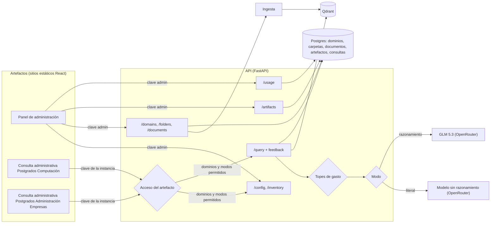

# MIA: Definición de Requerimientos de la Versión 2

**Qué es este documento:** requerimientos de la segunda versión de MIA, que agrega los dos primeros artefactos reales sobre la API del MVP: un **panel de administración** para gestionar la información cargada (dominios y documentos) y la configuración de acceso de cada artefacto, y un **cliente de consulta para el personal administrativo** que permite elegir dominios y modo de respuesta (literal o con razonamiento). Parte del estado descrito en [Definicion_Requerimientos_MVP.md](Definicion_Requerimientos_MVP.md) y [ARQUITECTURA.md](ARQUITECTURA.md). Redactado el 2026-10-06 y actualizado el 2026-10-07 (el inventario pasa a ser un módulo del panel de administración); las decisiones abiertas están en la sección 9.

## 1. Alcance

| Decisión | Elegido | Por qué |
|---|---|---|
| Artefactos | Dos aplicaciones web separadas: Panel de administración y Consulta administrativa | Tienen usuarios y permisos distintos (administrar vs. consultar), que es justamente la idea de "artefacto" del documento conceptual. |
| Organización de la información | Tres niveles: **unidad académica** (Computación, Administración de Empresas) > **dominio** (Memoria del Consejo, Currículum, Apertura de promoción, Docentes, Proyectos de graduación) > **carpetas** por tipo de fuente (Actas, Programas de curso...) | Es la organización del documento conceptual, repetida por cada unidad. La unidad agrupa y da permisos; el dominio es lo que se elige al consultar; las carpetas solo ordenan (ver 2.3). |
| Instancias de la Consulta administrativa | Dos, una por unidad académica: **Consulta administrativa Postgrados Computación** y **Consulta administrativa Postgrados Administración Empresas**, con el mismo código y configuraciones distintas | Siguen la misma jerarquía que la información (una instancia por unidad). Cada unidad ve solo su propia información (las actas del Consejo de Computación tienen datos personales de estudiantes que no corresponde mostrar a otra unidad) y su gasto se controla y se mide por separado. |
| Panel de administración | Un solo artefacto de gestión, organizado en módulos: Inventario de información, Artefactos y accesos, y Uso | Toda la configuración y el seguimiento de MIA se hacen desde un mismo lugar. Un tipo de configuración nuevo (usuarios, parámetros de búsqueda) se agrega como un módulo más, sin crear otro artefacto. |
| Acceso de los artefactos | Cada artefacto se registra en el panel con su propia clave, los dominios que puede consultar y los modos de respuesta que puede usar | Cada instancia de la Consulta administrativa accede solo a los dominios de su unidad, y un futuro chatbot web debe ver solo la información pertinente a su público y usar solo los modos más baratos. La restricción la aplica la API, no el artefacto. |
| Tope de gasto | Un tope diario en USD por artefacto, ajustable desde el panel, más un tope diario de toda la API fijado por variable de entorno como red de seguridad | Con varios artefactos, uno no puede agotar el presupuesto de los demás. Es indispensable antes de un artefacto público, cuya clave no se puede mantener en secreto (ver 2.5). |
| Tecnología de los artefactos | React + TypeScript + Vite, publicadas como sitios estáticos | Pedido explícito para el panel; se usa lo mismo en ambos para compartir el cliente de la API. Un sitio estático se publica gratis (Render Static Sites, Vercel). |
| Modos de respuesta | **Literal** (modelo sin razonamiento) y **Con razonamiento** (GLM 5.3), ambos por OpenRouter | Dos necesidades distintas: una respuesta fiel al texto de los documentos, o una inferencia que combine datos (sumar, comparar, contar). |
| Elección del modo | La API expone modos, no proveedores | Los artefactos piden "literal" o "razonamiento"; qué modelo hay detrás se configura en la API. Cambiar de modelo no obliga a cambiar los artefactos (mismo principio de piezas intercambiables del MVP). |
| Cliente web actual (`web/`) | Lo reemplaza la Consulta administrativa | La nueva versión hace todo lo que hace el cliente actual, más la elección de modo. |

## 2. Artefacto 1: Panel de administración

### 2.1 Propósito y usuarios

Gestionar MIA sin usar Swagger: qué información tiene cargada y qué puede hacer cada artefacto con ella. Lo usa quien opera el sistema (hoy el desarrollador; a futuro, alguien de Coordinación o Asistencia Administrativa), con la clave de administración.

El panel se organiza en módulos, cada uno una sección con su entrada en el menú lateral:

| Módulo | Qué gestiona | Requerimientos |
|---|---|---|
| Inventario de información | Dominios y documentos | 2.2 a 2.4 |
| Artefactos y accesos | Artefactos registrados, sus claves, dominios y modos permitidos, y topes de gasto | 2.5 y 2.6 |
| Uso | Gasto, consultas, tokens y tiempos, con gráficas por artefacto, modo y modelo, y el registro de consultas | 2.7 y 2.8 |

Requerimientos comunes a todo el panel:

| Id | Requerimiento |
|---|---|
| ADM-1 | Pedir la clave de administración la primera vez y recordarla en el navegador. Sin una clave válida se puede ver el inventario, pero no crear, subir ni ver o cambiar la configuración de artefactos, ni ver el módulo Uso. |
| ADM-2 | Navegar entre módulos con un menú lateral (en celular, desplegable). Al abrir el panel se muestra el Inventario. |
| ADM-3 | Un módulo nuevo se agrega como una sección más del menú y un grupo de rutas nuevo en la API, sin cambiar los módulos existentes. |

### 2.2 Módulo Inventario de información: requerimientos funcionales

Ver y administrar qué unidades académicas y dominios existen, qué documentos tiene cada uno y en qué estado están, y agregar unidades, dominios y documentos nuevos.

| Id | Requerimiento |
|---|---|
| INV-1 | Mostrar el inventario como un árbol de directorios: unidades académicas en el primer nivel, sus dominios en el segundo, carpetas (anidables) dentro de cada dominio y documentos como archivos (ver 2.3). Cada unidad y cada dominio muestran su descripción y cantidad de documentos; cada carpeta, su cantidad de documentos; cada documento, su tipo (PDF, DOCX, TXT), fecha de carga y estado. |
| INV-2 | Expandir y contraer cada unidad, dominio y carpeta. Al abrir la página se ven las unidades abiertas y sus dominios contraídos. |
| INV-3 | Crear una unidad académica nueva, y un dominio nuevo dentro de una unidad, con nombre y descripción. El nombre de una unidad es único; el de un dominio, único dentro de su unidad (las dos unidades tienen un dominio "Currículum"). Si se repite, mostrar el error sin perder lo escrito. |
| INV-4 | Agregar uno o varios documentos a un dominio o a una de sus carpetas, eligiendo archivos o arrastrándolos sobre el dominio o la carpeta. Solo se aceptan PDF, DOCX y TXT; los demás se rechazan con un mensaje antes de subirlos. |
| INV-5 | Mostrar el avance de cada documento: en cola, procesando, listo o error. El estado se actualiza solo, sin recargar la página, hasta que el documento queda listo o en error. |
| INV-6 | Si se sube un archivo que ya está en ese dominio (en cualquiera de sus carpetas), avisar que ya existía, en vez de mostrarlo como nuevo. |
| INV-7 | Si la instancia de la API tiene la carga de documentos desactivada (como Render free), mostrar el árbol en modo solo lectura, con los botones de agregar deshabilitados y un aviso que explique por qué. |
| INV-8 | Crear y subir exige la clave de administración (ADM-1). |
| INV-9 | Buscar en el árbol por nombre de unidad, dominio, carpeta o documento. |
| INV-10 | Crear carpetas dentro de un dominio o dentro de otra carpeta, sin límite de profundidad. El nombre no puede repetirse entre carpetas del mismo nivel; si se repite, mostrar el error sin perder lo escrito. |
| INV-11 | Renombrar una carpeta, y borrarla si está vacía (sin documentos ni subcarpetas). |
| INV-12 | Al crear un dominio, indicar qué artefactos lo verán de inmediato (los que tienen acceso a toda su unidad o a todos los dominios, ver ART-3) y recordar que los que tienen dominios elegidos uno a uno no lo verán hasta habilitarlo en el módulo Artefactos y accesos. |

### 2.3 Vista de árbol (boceto)

```
Inventario de información                 [ Buscar... ]  [ + Nueva unidad ]

v Computación  (133 documentos)                     Posgrados en Computación: MCC, MCSg y MGTI
    v Memoria del Consejo  (20 documentos)          Actas del Consejo de la Unidad de Posgrado
        v Actas  (20 documentos)
            > 2025  (20 documentos)
    v Currículum  (83 documentos)                   Planes de estudio y programas de curso
        > MCC  (20 documentos)
        > MCSg  (37 documentos)
        > MGTI  (26 documentos)
    > Apertura de promoción  (0 documentos)
    > Docentes  (0 documentos)
    > Proyectos de graduación  (30 documentos)
    [ + Nuevo dominio ]
v Administración de Empresas  (29 documentos)       Maestría en Analítica de Negocios
    > Memoria del Consejo  (6 documentos)
    v Currículum  (23 documentos)
        > Programas de curso  (17 documentos)
        v Documento constitutivo del programa  (2 documentos)
            documento-programa.docx        DOCX  2026-10-06    listo
            ...
            [ + Agregar documentos ]  [ + Nueva carpeta ]
        > Líneas de trabajos finales de graduación  (1 documento)
        > Reglamentos  (3 documentos)
    [ + Nuevo dominio ]
```

**Por qué la unidad es un nivel propio y no un dominio que contiene dominios:** el dominio es la unidad de búsqueda y de permisos (la consulta elige dominios y Qdrant filtra por dominio), y la carpeta es solo organización. Si "Computación" fuera un dominio y "Memoria del Consejo" una carpeta, ya no se podría preguntar solo sobre las actas. Con la unidad como nivel aparte, se consulta por dominio como hasta ahora y se dan permisos por unidad (ART-3).

**Las carpetas son solo para organizar.** La consulta sigue siendo por dominio: una pregunta sobre el Currículum de Computación busca en todas sus carpetas (MCC, MCSg, MGTI), y no se puede habilitar a un artefacto solo una carpeta. Así las carpetas no tocan Qdrant ni la ingesta (viven solo en la base SQL), y crearlas, renombrarlas o reorganizarlas no obliga a reprocesar documentos. Si más adelante hiciera falta consultar o permitir por carpeta, se agregaría la carpeta a la metadata de los fragmentos en Qdrant (ver sección 10).

Las carpetas cubren el nivel de "tipo de fuente" del documento conceptual (Currículum > Programas de curso > documento) creando una carpeta "Programas de curso", y además admiten otras organizaciones (por año, por programa).

**Reorganización de los datos ya cargados:** los cinco dominios actuales pasan a la nueva estructura. Como Qdrant identifica cada dominio por su id y no por su nombre, renombrarlos, asignarles unidad y ordenar sus documentos en carpetas se hace solo en la base SQL, sin volver a procesar ningún documento. Las carpetas se derivan de la ruta de cada archivo en las carpetas de origen (`tmp/`), con un script de una sola vez.

| Dominio actual | Unidad | Dominio nuevo | Carpetas |
|---|---|---|---|
| Computación: Consejo de Unidad | Computación | Memoria del Consejo | Actas > 2025 |
| Computación: Planes de estudio | Computación | Currículum | MCC, MCSg y MGTI, cada una con su carpeta de programas de curso (como en el origen) |
| Computación: Proyectos de graduación | Computación | Proyectos de graduación | Documento final de tesis |
| Analítica de Negocios: Consejo de Área | Administración de Empresas | Memoria del Consejo | Actas |
| Analítica de Negocios: Currículum | Administración de Empresas | Currículum | Programas de curso, Documento constitutivo del programa, Líneas de trabajos finales de graduación y Reglamentos |

Los dominios del documento conceptual que todavía no tienen documentos (Apertura de promoción y Docentes en Computación; Apertura de promoción, Docentes y Proyectos de graduación en Administración de Empresas) se crean vacíos, para que la estructura quede completa. Las aperturas de promoción de Computación existen, pero son imágenes (ver sección 10).

### 2.4 Inventario: fuera de alcance de esta versión

Borrar o renombrar dominios y documentos, borrar carpetas con contenido, reintentar un documento en error, mover documentos o carpetas (entre carpetas o entre dominios) y ver el contenido de un documento. Borrar exige limpiar también sus fragmentos en Qdrant, y reintentar exige conservar el archivo original, que hoy no se guarda en un almacenamiento persistente (ver [ESCALABILIDAD.md](ESCALABILIDAD.md)).

### 2.5 Módulo Artefactos y accesos: requerimientos funcionales

Un **artefacto** es cualquier aplicación que consulta a MIA (la Consulta administrativa, un futuro chatbot web para estudiantes). Cada uno se registra en este módulo y recibe su propia clave de consulta; con esa clave la API sabe qué artefacto pregunta y le aplica su configuración de acceso. El panel de administración no es un artefacto registrado: usa la clave de administración.

Un mismo producto se puede registrar **varias veces**, una por cada público: cada registro es una **instancia**, con su nombre, clave, dominios, modos y topes, y para la API y el módulo Uso es un artefacto independiente. Así la Consulta administrativa tiene dos instancias (sección 3): una por unidad académica, Computación y Administración de Empresas. Agregar una unidad académica más es registrar otra instancia, sin escribir código.

| Id | Requerimiento |
|---|---|
| ART-1 | Listar los artefactos registrados con su nombre, descripción, estado (activo o desactivado), dominios y modos permitidos, gasto de hoy frente a su tope (barra de avance) y cantidad de consultas de los últimos 7 días. |
| ART-2 | Registrar un artefacto nuevo con nombre (único) y descripción. Al crearlo, la API genera su clave y el panel la muestra **una sola vez**, con un botón para copiarla; después solo se ve su comienzo (p. ej. `mia_k3f9...`). |
| ART-3 | Elegir los **dominios** que puede consultar, combinando: unidades académicas completas (incluye los dominios que se creen después en ellas), dominios elegidos uno a uno, o "todos los dominios" (incluye unidades futuras). Debe tener al menos uno. |
| ART-4 | Elegir los **modos de respuesta** que puede usar (literal, con razonamiento, ver 3.3). Debe tener al menos uno. Junto a cada modo se indica su costo aproximado por consulta, para decidir con ese dato. |
| ART-5 | Los cambios de dominios y modos rigen desde la consulta siguiente, sin reiniciar la API ni volver a publicar el artefacto. |
| ART-6 | Regenerar la clave de un artefacto (si se filtró o se publicó por error): la anterior deja de funcionar de inmediato y la nueva se muestra una sola vez, como en ART-2. |
| ART-7 | Desactivar y reactivar un artefacto. Desactivado, sus consultas responden 403 con un mensaje que lo explica; su configuración y su registro de consultas se conservan. |
| ART-8 | Fijar el **tope diario de gasto** del artefacto en USD, para todos sus modos juntos, y opcionalmente un tope menor solo para el modo con razonamiento (el más caro). Un artefacto nuevo arranca con un tope bajo (p. ej. 0.50 USD) y no se puede dejar sin tope. Junto al campo se muestra cuántas consultas alcanza aproximadamente, según el costo medio de cada modo en los últimos 7 días. |
| ART-9 | Al alcanzar su tope, el artefacto (o solo su modo con razonamiento, si alcanzó ese tope) responde 429 hasta la medianoche, sin afectar a los demás artefactos. Desde el panel se puede subir el tope en el momento, y rige en la consulta siguiente (ART-5). |
| ART-10 | Avisar en el panel cuando la suma de los topes de los artefactos supera el tope de toda la API (sección 5): en ese caso un artefacto puede quedarse sin servicio por el gasto de otros aunque no haya alcanzado su propio tope. |

Ejemplos de configuración:

| Artefacto | Dominios | Modos | Por qué |
|---|---|---|---|
| Consulta administrativa Postgrados Computación | Unidad Computación completa | Literal y con razonamiento | Lo usa el personal administrativo de la Unidad de Posgrado en Computación, con toda la información de su unidad y preguntas que combinan datos. |
| Consulta administrativa Postgrados Administración Empresas | Unidad Administración de Empresas completa | Literal y con razonamiento | Lo mismo para los posgrados de Administración de Empresas (hoy solo la Maestría en Analítica de Negocios, compartida entre las dos áreas), sin acceso a la información de Computación. Si la unidad suma otro posgrado, esta instancia lo ve sin cambiar nada. |
| Chatbot web (futuro) | Currículum y Apertura de promoción de cada unidad | Literal | Solo la información pertinente para estudiantes (no las actas del Consejo) y solo el modo más barato, para ahorrar tokens. |

**Cómo lo aplica la API:** la configuración vive en la base (tabla de artefactos) y la API la aplica en cada consulta, no el artefacto, porque el código de un sitio estático se puede modificar. Con la clave de un artefacto:

- `GET /domains` devuelve solo los dominios permitidos, y `GET /config` solo los modos permitidos, así el artefacto muestra únicamente lo que puede usar.
- `POST /query` responde 403 si pide un dominio o un modo no permitido.
- Antes de cada consulta, la API compara lo gastado hoy por el artefacto (y por toda la API) con sus topes, y responde 429 si ya se alcanzaron. El costo de cada consulta se conoce recién al terminar, así que un tope puede excederse por el costo de una sola consulta, que el máximo de tokens de respuesta acota (hoy 8000).
- Cada consulta queda registrada con el artefacto que la hizo y su costo (sección 4), lo que permite medir el uso de cada uno (módulo Uso, 2.7).

**Por qué un tope por artefacto:** la clave de un artefacto público (un chatbot para estudiantes) va dentro de un sitio que usa cualquiera, así que no se puede mantener en secreto: alguien podría copiarla y mandar consultas en masa. Con un tope por artefacto, ese abuso agota solo el presupuesto del chatbot, y la Consulta administrativa sigue funcionando.

### 2.6 Boceto del módulo

```
Panel de administración de MIA

  Inventario            Artefactos y accesos                       [ + Nuevo artefacto ]
> Artefactos y accesos
                        Consulta administrativa Postgrados Computación               activo  mia_k3f9...   164 consultas (7 días)
                          Dominios: unidad Computación (5 dominios)
                          Modos:    [x] Literal  [x] Con razonamiento
                          Tope:     0.90 / 1.50 USD hoy  [######----]   razonamiento: 0.70 / 1.00 USD
                          [ Editar ]  [ Regenerar clave ]  [ Desactivar ]

                        Consulta administrativa Postgrados Administración Empresas   activo  mia_7d2a...    48 consultas (7 días)
                          Dominios: unidad Administración de Empresas (5 dominios)
                          Modos:    [x] Literal  [x] Con razonamiento
                          Tope:     0.30 / 1.00 USD hoy  [###-------]   razonamiento: 0.20 / 0.60 USD
                          [ Editar ]  [ Regenerar clave ]  [ Desactivar ]

                        Chatbot web                    activo     mia_p81c...    0 consultas (7 días)
                          Dominios: Currículum, Apertura de promoción
                          Modos:    [x] Literal  [ ] Con razonamiento
                          Tope:     0.00 / 0.50 USD hoy  [----------]
                          [ Editar ]  [ Regenerar clave ]  [ Desactivar ]
```

**Configuraciones futuras:** si más adelante se configura algo más por artefacto (un tope mensual, el número de fragmentos recuperados, la instrucción al modelo, usuarios con acceso), se agrega como un campo más del artefacto en este módulo; si es una configuración global de MIA, como un módulo nuevo del panel (ADM-3).

### 2.7 Módulo Uso: requerimientos funcionales

Ver cuánto se usa MIA y cuánto cuesta, al estilo de la página *Activity* de OpenRouter, pero desglosado por artefacto. Sale del registro de consultas (sección 4), así que no depende de que OpenRouter conserve el historial.

| Id | Requerimiento |
|---|---|
| USO-1 | Elegir el período (hoy, últimos 7 días, últimos 30 días o un rango de fechas) y filtrar por artefacto y por modo. Todo el módulo responde a esa selección. |
| USO-2 | Mostrar indicadores del período: gasto total en USD, cantidad de consultas, tokens (de entrada, de salida y de razonamiento), costo medio por consulta, tiempo de respuesta (mediana y el 95 % más lento), porcentaje de respuestas "sin información", porcentaje de errores y porcentaje de respuestas calificadas como útiles. Cada indicador se compara con el período anterior de igual duración (p. ej. "+12 %"). |
| USO-3 | Gráfica de barras apiladas a lo largo del tiempo (por hora si el período es "hoy", por día en los demás), con selector de métrica: gasto, consultas o tokens, y selector de desglose: por artefacto, por modo o por modelo. |
| USO-4 | Tabla por artefacto: gasto de hoy frente a su tope (barra de avance), y gasto, consultas y tiempo medio del período. Desde cada fila se puede ir a su configuración (ART-8). |
| USO-5 | Tabla por modelo: consultas, tokens, gasto y tiempo medio del período. Muestra qué modelo concentra el gasto y sirve para comparar modelos cuando se cambia el de un modo. |
| USO-6 | Registro de consultas, de la más reciente a la más antigua, con paginación: fecha, artefacto, modo, modelo, tokens, costo, tiempo, resultado (respondida, sin información, error, rechazada por tope o por permisos) y calificación. Al abrir una se ve la pregunta, los dominios consultados, los documentos citados y el comentario de la calificación. |
| USO-7 | Mostrar el saldo restante en OpenRouter y cuántos días alcanza al ritmo de gasto de los últimos 7 días, con un aviso cuando quede para menos de una semana. |
| USO-8 | Descargar en CSV el registro de consultas del período (sin el texto de las preguntas, salvo que se pida explícitamente), para el análisis de la evaluación con usuarios. |

Las preguntas pueden contener datos personales (como las actas cargadas, ver [OPERACION.md](OPERACION.md)), por eso el registro y su detalle solo se ven con la clave de administración.

### 2.8 Boceto del módulo

```
Uso                     [ Hoy | 7 días | 30 días | Rango ]   Artefacto: [ Todos v ]   Modo: [ Todos v ]

  Gasto        Consultas    Tokens        Costo medio   Tiempo (mediana)  Sin información  Útiles
  3.42 USD     248          1.9 M         0.014 USD     6.1 s             9 %              81 %
  +12 %        +5 %         +18 %         +7 %          -3 %              -2 pts           +4 pts

  Gasto por día, por artefacto            [ Gasto | Consultas | Tokens ]  [ Artefacto | Modo | Modelo ]
  0.80 |            ##
       |       ##   ##   ##               ## Consulta administrativa Postgrados Computación
  0.40 |  ##   ##   ##   ##   ..          .. Consulta administrativa Postgrados Administración Empresas
       +--------------------------
         2/10 3/10 4/10 5/10 6/10

  Por artefacto                                               Hoy / tope                 Gasto    Consultas   Tiempo medio
  Consulta administrativa Postgrados Computación               0.90 / 1.50  [######----]  2.60     164         7.2 s
  Consulta administrativa Postgrados Administración Empresas   0.30 / 1.00  [###-------]  0.82      48         5.1 s

  Saldo OpenRouter: 11.40 USD, alcanza para unos 23 días al ritmo actual

  Consultas recientes
  08/10 10:42  Postgrados Computación             razonamiento  glm-5.3        3 812 tokens  0.021 USD  18.4 s  respondida   útil
  08/10 10:39  Postgrados Administración Empresas  literal       flash-lite     2 140 tokens  0.001 USD   2.1 s  sin inform.  -
  08/10 10:31  Postgrados Administración Empresas  literal       -                  -          -           -    rechazada (tope)
```

Las gráficas usan una biblioteca de gráficas para React (p. ej. Recharts), con los colores del modo claro y oscuro del panel.

## 3. Artefacto 2: Consulta administrativa

### 3.1 Propósito y usuarios

Cliente de consulta para el personal administrativo (Coordinación y Asistencia Administrativa): preguntar en lenguaje natural sobre los dominios elegidos y decidir si se quiere una respuesta literal o una con razonamiento. Es también el artefacto con el que se hará la evaluación con usuarios (objetivo específico 5).

Se publican **dos instancias** del mismo producto, cada una registrada en el panel con su propia configuración (ver ejemplos en 2.5):

| Instancia | Usuarios | Dominios |
|---|---|---|
| Consulta administrativa Postgrados Computación | Personal de la Unidad de Posgrado en Computación | Los de la unidad Computación |
| Consulta administrativa Postgrados Administración Empresas | Personal de los posgrados de Administración de Empresas (hoy, la Maestría en Analítica de Negocios) | Los de la unidad Administración de Empresas |

Las dos usan el mismo código y la misma compilación; lo que cambia es la clave con que se abren. El nombre, los dominios y los modos que muestra cada una vienen de la API según esa clave (CON-10), así que una persona de Administración de Empresas no puede ver dominios de Computación aunque modifique el sitio.

### 3.2 Requerimientos funcionales

| Id | Requerimiento |
|---|---|
| CON-1 | Mostrar los dominios que el artefacto tiene permitidos (ART-3), agrupados por unidad académica si tiene más de una, con una casilla para seleccionarlos o deseleccionarlos, más "todos" y "ninguno". No se puede preguntar sin al menos un dominio seleccionado. La selección se recuerda en el navegador. |
| CON-2 | Elegir el modo de respuesta antes de cada pregunta, entre los que el artefacto tiene permitidos (ART-4): **Literal** o **Con razonamiento** (ver 3.3), con una explicación corta de cada uno junto al selector. El modo elegido se recuerda. Si solo tiene un modo permitido, no se muestra el selector. |
| CON-3 | Si la API no tiene configurado el modo con razonamiento, o el artefacto ya alcanzó su tope diario de ese modo (ART-8), mostrar esa opción deshabilitada y el motivo. Si alcanzó su tope total, o la API alcanzó el suyo, deshabilitar el envío de preguntas hasta la medianoche, con el motivo. Un modo no permitido para el artefacto no se muestra. |
| CON-4 | Mostrar las respuestas como conversación, con formato (negritas y listas) y, debajo de cada una, las fuentes citadas (dominio y documento) con los fragmentos desplegables. |
| CON-5 | Indicar en cada respuesta con qué modo se generó y cuánto tardó. Mientras espera, mostrar que está trabajando; en modo con razonamiento, avisar que puede tardar más. |
| CON-6 | Distinguir visualmente la respuesta "sin información suficiente" del resto. |
| CON-7 | Ante un error (LLM saturado, sin conexión, tope alcanzado), mostrar un mensaje claro y un botón para reintentar, y en el caso del razonamiento ofrecer reintentar en modo literal. |
| CON-8 | Calificar cada respuesta como útil o no útil, con un comentario opcional. Es el insumo para las métricas de la evaluación con usuarios, hoy pendientes. |
| CON-9 | Pedir la clave de consulta la primera vez y recordarla en el navegador. Es la clave de la instancia, generada en el panel (ART-2). |
| CON-10 | Mostrar en el encabezado y en el título de la pestaña el nombre de la instancia (p. ej. "Consulta administrativa Postgrados Administración Empresas"), que la API devuelve según la clave. |

Cada pregunta se responde por separado: el sistema no recuerda las preguntas anteriores de la conversación (ver sección 10).

### 3.3 Modos de respuesta

| | Literal | Con razonamiento |
|---|---|---|
| Para qué | Saber qué dice exactamente un documento: un acuerdo, un requisito, una fecha. | Preguntas que combinan datos: sumar créditos de varios cursos, comparar horas entre programas, contar acuerdos sobre un tema. |
| Modelo | Un modelo rápido sin razonamiento, por OpenRouter (p. ej. Gemini 3.5 Flash-Lite) | GLM 5.3, por OpenRouter, con razonamiento activado |
| Instrucción al modelo | La actual: responder solo con lo que dicen los fragmentos, citando lo más textual posible. | Puede combinar, comparar y calcular a partir de los fragmentos. Debe mostrar los datos que usó (p. ej. "4 + 4 + 4 = 12") y separar lo que dice el documento de lo que infiere. Sigue sin usar conocimiento externo. |
| Fragmentos recuperados | 8 resultados más vecinos (como hoy) | Más resultados (p. ej. 16), para que entren datos de más documentos. |
| Tiempo esperado | Segundos | Decenas de segundos |
| Costo por consulta | Bastante menor que con razonamiento (se medirá en el módulo Uso) | Unos 0.02 USD con el volumen de contexto actual |

Los dos modelos se pagan con el mismo saldo prepagado de OpenRouter (con retención cero de datos, necesaria por la información sensible cargada) y se cambian por variable de entorno sin tocar los artefactos. Los costos son aproximados y los reales quedan en el módulo Uso (2.7).

Limitación conocida: el modo con razonamiento mejora lo que el modelo hace con los fragmentos, pero no cambia qué fragmentos llegan. Una pregunta sobre "todos los cursos" sigue dependiendo de que la búsqueda traiga datos de todos, y hoy no lo hace (prueba del 2026-10-06 en [ESCALABILIDAD.md](ESCALABILIDAD.md)). Resolverlo queda para la versión 3 (sección 10).

## 4. Cambios en la API

| Método | Ruta | Cambio | Para |
|---|---|---|---|
| `GET` | `/config` | **Nuevo.** Informa qué puede hacer la instancia: si la carga de documentos está activa y qué modos de respuesta hay disponibles (con su nombre y descripción). Con la clave de un artefacto, solo los modos que tiene permitidos, y si alcanzó alguno de sus topes. | INV-7, CON-3, ART-4, ART-9 |
| `GET` | `/inventory` | **Nuevo.** Devuelve todas las unidades con sus dominios, carpetas y documentos en una sola llamada, para armar el árbol sin pedir dominio por dominio. | INV-1 |
| `GET`, `POST` | `/units` | **Nuevo.** Lista y crea unidades académicas. Crear exige la clave de administración; 409 si el nombre ya existe. | INV-3 |
| `POST` | `/domains/{id}/folders` | **Nuevo.** Crea una carpeta en el dominio, o dentro de otra carpeta si se indica la carpeta padre. 409 si el nombre ya existe en ese nivel. Exige la clave de administración. | INV-10 |
| `PATCH`, `DELETE` | `/folders/{id}` | **Nuevo.** Renombra una carpeta, o la borra si está vacía (409 si no lo está). Exige la clave de administración. | INV-11 |
| `GET` | `/domains` | Incluye la unidad de cada dominio. Con la clave de un artefacto, devuelve solo sus dominios permitidos. | CON-1, ART-3 |
| `POST` | `/domains` | Recibe la unidad a la que pertenece. Exige la clave de administración. Devuelve 409 si el nombre ya existe en esa unidad (hoy falla con un error genérico de la base). | INV-3, ADM-1 |
| `POST` | `/domains/{id}/documents` | Exige la clave de administración. Recibe opcionalmente la carpeta de destino. Indica en la respuesta si el documento ya existía (en cualquier carpeta del dominio). Límite de tamaño de archivo (p. ej. 25 MB). | INV-4, INV-6, ADM-1 |
| `GET` | `/domains/{id}/documents` | Sin cambios; se usa para actualizar el estado de los documentos en proceso. | INV-5 |
| `GET` | `/artifacts` | **Nuevo.** Lista los artefactos con su configuración, gasto de hoy frente a sus topes y uso de los últimos 7 días (nunca la clave). Exige la clave de administración. | ART-1 |
| `POST` | `/artifacts` | **Nuevo.** Registra un artefacto y devuelve su clave, por única vez. 409 si el nombre ya existe. Exige la clave de administración. | ART-2 |
| `PATCH` | `/artifacts/{id}` | **Nuevo.** Cambia descripción, dominios, modos, topes o estado (activo o desactivado). Exige la clave de administración. | ART-3, ART-4, ART-5, ART-7, ART-8 |
| `POST` | `/artifacts/{id}/key` | **Nuevo.** Regenera la clave y la devuelve por única vez. Exige la clave de administración. | ART-6 |
| `POST` | `/query` | Recibe el modo (`literal` por defecto, o `razonamiento`). Exige la clave de un artefacto activo. Devuelve 403 si pide un dominio o un modo que el artefacto no tiene permitido. Devuelve además un identificador de la consulta, el modo usado y el tiempo de respuesta. Devuelve 429 si el artefacto o la API alcanzaron su tope diario. | CON-2, CON-5, CON-9, ART-3, ART-4 |
| `POST` | `/query/{id}/feedback` | **Nuevo.** Guarda la calificación (útil o no útil) y el comentario. | CON-8 |
| `GET` | `/usage` | **Nuevo.** Indicadores y series de tiempo de un período, con filtros por artefacto y modo, y desglose por artefacto, modo o modelo. Exige la clave de administración. | USO-1 a USO-5 |
| `GET` | `/usage/queries` | **Nuevo.** Registro de consultas paginado (y en CSV con `?formato=csv`); `/usage/queries/{id}` da el detalle de una. Exige la clave de administración. | USO-6, USO-8 |
| `GET` | `/usage/balance` | **Nuevo.** Saldo restante en OpenRouter, consultado a su API. Exige la clave de administración. | USO-7 |

**Registro de consultas:** cada consulta se guarda en una tabla nueva: artefacto, pregunta, dominios, modo, modelo, tokens (de entrada, de salida y de razonamiento), costo en USD, tiempo, resultado (respondida, sin información, error o rechazada, con el motivo) y calificación. Las rechazadas por tope o por permisos también se guardan, con costo cero, para detectar abusos. Da la base para las métricas de la evaluación con usuarios, para el módulo Uso (2.7) y para controlar los topes. El costo se toma del que informa OpenRouter en cada respuesta (a confirmar en la implementación); si no lo informara, se calcula con los tokens y el precio del modelo. Las preguntas se guardan bajo las mismas condiciones que los documentos con datos personales (ver [OPERACION.md](OPERACION.md)).

**Tablas nuevas:** `units` (nombre, descripción), `artifacts` (nombre, descripción, hash de la clave, activo, todos los dominios sí o no, modos permitidos, tope diario total y tope diario del modo con razonamiento), `artifact_units` y `artifact_domains` (unidades y dominios permitidos), `queries` (registro de consultas) y `folders` (dominio, carpeta padre, nombre). Las tablas nuevas las crea `create_all` sin migraciones, pero hay cambios en tablas que ya existen en Neon (la unidad de cada dominio, el nombre de dominio único por unidad en vez de único global, y la carpeta de cada documento): por eso esta versión incorpora Alembic, que ya estaba pendiente en [ESCALABILIDAD.md](ESCALABILIDAD.md).

## 5. Requerimientos no funcionales

- **Claves de acceso:** la clave de administración se configura por variable de entorno en la API (`ADMIN_KEY`), porque es la que permite registrar todo lo demás. Las claves de consulta son una por artefacto, las genera la API (ART-2) y se guardan solo como hash, igual que una contraseña: si se pierde, se regenera. Los artefactos las piden a la persona usuaria y las envían en un encabezado; no van escritas en el código publicado, porque cualquiera puede leer el código de un sitio estático. Es un control mínimo, no un sistema de usuarios (ver sección 10).
- **Topes de gasto:** dos niveles, ambos en USD por día y reiniciados a medianoche (hora de la zona configurada en la API):
  - **Por artefacto** (ART-8 a ART-10): se ajusta desde el panel y aísla a los artefactos entre sí.
  - **De toda la API** (`TOPE_DIARIO_USD`, p. ej. 3 USD): se fija por variable de entorno y no se puede cambiar desde el panel, para que una clave de administración filtrada no pueda subirlo. Reparte el saldo prepagado de OpenRouter, que sigue siendo el tope duro mensual, para que un mal día no lo agote: si se agota, dejan de responder todos los modos, incluido el literal.

  Son topes propios, independientes de OpenRouter, porque el prototipo no admite cobros variables sin límite.
- **CORS:** la API debe aceptar peticiones de los dominios donde se publiquen los artefactos (hoy no tiene CORS y el cliente actual depende del proxy de Vite en desarrollo).
- **Tiempo de espera:** los artefactos esperan hasta 200 s antes de dar una respuesta por perdida (Render dormido más razonamiento). La subida de documentos no bloquea la interfaz: el archivo queda en cola y el estado se consulta aparte.
- **Sin cambios en el pipeline de ingesta ni en Qdrant:** los artefactos solo usan la API, y la restricción de dominios reutiliza el filtro por dominio que ya tiene la búsqueda. Un dominio creado desde el panel aparece en la consulta sin reiniciar nada (en los artefactos con "todos los dominios").
- **Idioma y accesibilidad:** interfaz en español, utilizable en pantalla de computadora y de celular, con modo oscuro (como el cliente actual).
- **Pruebas:** tests de la API para cada endpoint nuevo o modificado; `scripts/pruebas_mvp.py` acepta el modo y sigue dando 19 de 19 en modo literal.

## 6. Arquitectura



La API mantiene un modelo por modo, configurado por variables de entorno (p. ej. `OPENROUTER_MODEL_LITERAL` y `OPENROUTER_MODEL_RAZONAMIENTO`), en lugar del único `OPENROUTER_MODEL` actual. Cada modo tiene su propia instrucción al modelo y su cantidad de fragmentos.

## 7. Stack y despliegue

- **Artefactos:** React + TypeScript + Vite, en `web/admin/` (Panel de administración) y `web/consulta/`, con el cliente de la API compartido entre ambos. La Consulta administrativa reemplaza al cliente actual de `web/`.
- **Publicación:** sitios estáticos gratuitos (Render Static Sites o Vercel), apuntando a la URL de la API. La Consulta administrativa se compila una vez y se publica dos veces, con una dirección por instancia (p. ej. `mia-computacion` y `mia-administracion`). Con direcciones separadas, cada instancia recuerda su propia clave en el navegador (el almacenamiento del navegador es por dirección) y cada unidad tiene un enlace propio. Una tercera unidad sería otra publicación de la misma compilación.
- **API:** en Railway Hobby con OpenRouter (decisión 9.2, [OPERACION.md](OPERACION.md)). Contra una instancia con la carga desactivada (como Render free), el inventario se usa en modo lectura.

## 8. Criterios de aceptación

1. Desde el panel se crea un dominio nuevo en la unidad Computación y aparece de inmediato en Consulta administrativa Postgrados Computación (que tiene la unidad completa) sin reiniciar la API; en Consulta administrativa Postgrados Administración Empresas no aparece.
2. Contra una instancia con carga activa, se suben dos documentos a ese dominio; su estado avanza solo hasta "listo", y una pregunta sobre su contenido se responde citándolos.
3. Subir de nuevo uno de esos archivos avisa que ya existía y no duplica fragmentos.
4. Contra Render (carga desactivada), el árbol se ve completo y los botones de agregar aparecen deshabilitados con su explicación.
5. Crear un dominio, subir un documento o ver o cambiar artefactos sin la clave de administración responde 401; consultar sin la clave de un artefacto también.
6. En modo literal, `scripts/pruebas_mvp.py` da 19 de 19.
7. En modo con razonamiento, "¿Cuántos créditos suman Sistemas Operativos Avanzados, Análisis de Algoritmos y Diseño de Experimentos?" responde 12, mostrando los créditos de cada curso y citando los tres programas.
8. Con un tope del modo con razonamiento bajo en el artefacto de prueba, al alcanzarlo ese modo queda deshabilitado en la Consulta, la API responde 429 y el modo literal sigue funcionando; otro artefacto puede seguir usando el modo con razonamiento. Al subir el tope desde el panel, la consulta siguiente funciona.
9. Sin modelo configurado para el modo con razonamiento, ese modo aparece deshabilitado con su motivo.
10. Una calificación de útil o no útil queda guardada junto a su consulta.
11. Se registra un artefacto de prueba con un solo dominio y solo el modo literal: con su clave, `GET /domains` devuelve solo ese dominio, `GET /config` solo el modo literal, y una consulta a otro dominio o en modo con razonamiento responde 403.
12. Al regenerar la clave de un artefacto, la anterior responde 401 y la nueva funciona; al desactivarlo, sus consultas responden 403, y al reactivarlo vuelven a funcionar con la misma configuración.
13. Un cambio de dominios, modos o topes hecho en el panel rige en la consulta siguiente del artefacto, sin reiniciar la API.
14. Al alcanzar `TOPE_DIARIO_USD`, todos los artefactos responden 429 hasta la medianoche, aunque no hayan alcanzado su propio tope.
15. Tras una serie de consultas de prueba desde dos artefactos, el módulo Uso muestra el gasto, las consultas y los tokens de cada uno, y el gasto total coincide (con diferencia menor al 5 %) con el que muestra OpenRouter para el mismo período.
16. El registro de consultas muestra las rechazadas por tope o por permisos, con su motivo.
17. Con la clave de Consulta administrativa Postgrados Administración Empresas, la Consulta muestra su nombre y solo los dominios de la unidad Administración de Empresas, y una consulta a un dominio de Computación (enviada directamente a la API) responde 403. Lo mismo al revés.
18. Tras la reorganización, el árbol del inventario coincide con la tabla de 2.3, los 162 documentos conservan su estado "listo" sin haberse reprocesado, y `scripts/pruebas_mvp.py` sigue dando 19 de 19 con los dominios nuevos.

## 9. Decisiones pendientes

1. ~~**Nivel de tipo de fuente en el árbol.**~~ Resuelto el 2026-10-07: en su lugar, carpetas libres y anidables dentro de cada dominio, solo para organizar (ver 2.3, INV-10 e INV-11). El 2026-10-08 se sumó la unidad académica por encima de los dominios. Requiere Alembic para agregar la carpeta a la tabla `documents` existente.
2. ~~**Dónde se cargan documentos.**~~ Resuelto el 2026-10-07: en el servidor. La API pasa a Railway Hobby (5 USD al mes, sin el límite de 512 MB de Render free), así que el inventario puede cargar documentos en producción y lo puede usar el personal, no solo quien opera el sistema. Los modelos de los dos modos (literal y con razonamiento) se contratan por OpenRouter. Ver [OPERACION.md](OPERACION.md).
3. **Una aplicación o dos.** Este documento propone dos sitios separados. Alternativa: una sola aplicación con dos secciones, más simple de publicar pero que mezcla los permisos de administrar y de consultar. Con el registro de artefactos (2.5) se refuerza la separación: el panel configura a los artefactos de consulta, y no es uno de ellos.
4. ~~**Tope diario: global o por artefacto.**~~ Resuelto el 2026-10-08: los dos. Un tope por artefacto ajustable desde el panel (ART-8 a ART-10) y un tope de toda la API por variable de entorno (sección 5), ambos en USD por día y aplicados a todos los modos.

## 10. Fuera de la versión 2 (candidatos para la versión 3)

- **Preguntas de agregación sobre todo un dominio** ("todos los cursos"): recuperación con herramientas (el modelo decide qué buscar) o datos estructurados extraídos al cargar (créditos, horas, requisitos).
- **Memoria de conversación:** preguntas de seguimiento que se apoyen en las anteriores.
- **Usuarios individuales:** cuentas con su propia identidad dentro de un artefacto (hoy los permisos son por artefacto, ver 2.5, y todas las personas que usan un artefacto comparten su clave). Se agregarían como un módulo más del panel de administración.
- **Administración completa del inventario:** borrar, renombrar, mover y reintentar documentos, con los archivos originales en almacenamiento persistente.
- **Consulta y permisos por carpeta:** buscar solo en una carpeta de un dominio, o habilitar a un artefacto solo algunas carpetas. Requiere guardar la carpeta en la metadata de los fragmentos en Qdrant.
- **Nuevas fuentes:** CSV, XLSX y páginas web (ACM, repositorio Orion).
