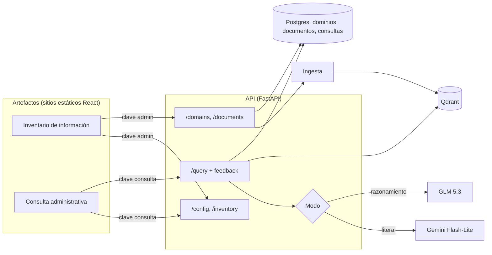

# MIA: Definición de Requerimientos de la Versión 2

**Qué es este documento:** requerimientos de la segunda versión de MIA, que agrega los dos primeros artefactos reales sobre la API del MVP: un **inventario de información** para administrar dominios y documentos, y un **cliente de consulta para el personal administrativo** que permite elegir dominios y modo de respuesta (literal o con razonamiento). Parte del estado descrito en [Definicion_Requerimientos_MVP.md](Definicion_Requerimientos_MVP.md) y [ARQUITECTURA.md](ARQUITECTURA.md). Redactado el 2026-10-06; las decisiones abiertas están en la sección 9.

## 1. Alcance

| Decisión | Elegido | Por qué |
|---|---|---|
| Artefactos | Dos aplicaciones web separadas: Inventario y Consulta administrativa | Tienen usuarios y permisos distintos (administrar vs. consultar), que es justamente la idea de "artefacto" del documento conceptual. |
| Tecnología de los artefactos | React + TypeScript + Vite, publicadas como sitios estáticos | Pedido explícito para el inventario; se usa lo mismo en ambos para compartir el cliente de la API. Un sitio estático se publica gratis (Render Static Sites, Vercel). |
| Modos de respuesta | **Literal** (Gemini Flash-Lite, sin razonamiento) y **Con razonamiento** (GLM 5.3) | Dos necesidades distintas: una respuesta fiel al texto de los documentos, o una inferencia que combine datos (sumar, comparar, contar). |
| Elección del modo | La API expone modos, no proveedores | Los artefactos piden "literal" o "razonamiento"; qué modelo hay detrás se configura en la API. Cambiar de modelo no obliga a cambiar los artefactos (mismo principio de piezas intercambiables del MVP). |
| Cliente web actual (`web/`) | Lo reemplaza la Consulta administrativa | La nueva versión hace todo lo que hace el cliente actual, más la elección de modo. |

## 2. Artefacto 1: Inventario de información

### 2.1 Propósito y usuarios

Ver y administrar qué información tiene cargada MIA: qué dominios existen, qué documentos tiene cada uno y en qué estado están, y agregar dominios y documentos nuevos sin usar Swagger. Lo usa quien opera el sistema (hoy el desarrollador; a futuro, alguien de Coordinación o Asistencia Administrativa).

### 2.2 Requerimientos funcionales

| Id | Requerimiento |
|---|---|
| INV-1 | Mostrar el inventario como un árbol de directorios: dominios como carpetas y documentos como archivos (ver 2.3). Cada dominio muestra su descripción y cantidad de documentos; cada documento, su tipo (PDF, DOCX, TXT), fecha de carga y estado. |
| INV-2 | Expandir y contraer cada dominio. Al abrir la página se ven todos los dominios contraídos. |
| INV-3 | Crear un dominio nuevo con nombre y descripción. Si el nombre ya existe, mostrar el error sin perder lo escrito. |
| INV-4 | Agregar uno o varios documentos a un dominio, eligiendo archivos o arrastrándolos sobre la carpeta del dominio. Solo se aceptan PDF, DOCX y TXT; los demás se rechazan con un mensaje antes de subirlos. |
| INV-5 | Mostrar el avance de cada documento: en cola, procesando, listo o error. El estado se actualiza solo, sin recargar la página, hasta que el documento queda listo o en error. |
| INV-6 | Si se sube un archivo que ya está en ese dominio, avisar que ya existía, en vez de mostrarlo como nuevo. |
| INV-7 | Si la instancia de la API tiene la carga de documentos desactivada (como Render free), mostrar el árbol en modo solo lectura, con los botones de agregar deshabilitados y un aviso que explique por qué. |
| INV-8 | Pedir la clave de administración la primera vez y recordarla en el navegador. Sin una clave válida se puede ver el árbol, pero no crear ni subir. |
| INV-9 | Buscar en el árbol por nombre de dominio o de documento. |

### 2.3 Vista de árbol (boceto)

```
Inventario de MIA                                   [ Buscar... ]  [ + Nuevo dominio ]

v Memoria del Consejo  (3 documentos)               Actas del Consejo Institucional
    acta-aprobada-3436.pdf      PDF   2026-09-27    listo
    acta-aprobada-3437.pdf      PDF   2026-09-27    listo
    acta-aprobada-3438.pdf      PDF   2026-09-27    procesando...
    [ + Agregar documentos ]
> Currículum  (4 documentos)                        Programas de curso de la Maestría en Computación
> Apertura de promoción  (0 documentos)
```

Si se adopta el nivel de **tipo de fuente** (decisión 9.1), el árbol suma un nivel intermedio, que es la organización descrita en el documento conceptual:

```
v Currículum
    v Programas de curso
        MC6004-Sistemas Operativos Avanzados.pdf    listo
    > Documento constitutivo de la maestría
```

### 2.4 Fuera de alcance de esta versión

Borrar o renombrar dominios y documentos, reintentar un documento en error, mover documentos entre dominios y ver el contenido de un documento. Borrar exige limpiar también sus fragmentos en Qdrant, y reintentar exige conservar el archivo original, que hoy no se guarda en un almacenamiento persistente (ver [ESCALABILIDAD.md](ESCALABILIDAD.md)).

## 3. Artefacto 2: Consulta administrativa

### 3.1 Propósito y usuarios

Cliente de consulta para el personal administrativo (Coordinación y Asistencia Administrativa): preguntar en lenguaje natural sobre los dominios elegidos y decidir si se quiere una respuesta literal o una con razonamiento. Es también el artefacto con el que se hará la evaluación con usuarios (objetivo específico 5).

### 3.2 Requerimientos funcionales

| Id | Requerimiento |
|---|---|
| CON-1 | Mostrar todos los dominios existentes con una casilla para seleccionarlos o deseleccionarlos, más "todos" y "ninguno". No se puede preguntar sin al menos un dominio seleccionado. La selección se recuerda en el navegador. |
| CON-2 | Elegir el modo de respuesta antes de cada pregunta: **Literal** o **Con razonamiento** (ver 3.3), con una explicación corta de cada uno junto al selector. El modo elegido se recuerda. |
| CON-3 | Si la API no tiene configurado el modo con razonamiento, o ya se alcanzó su tope diario (sección 5), mostrar esa opción deshabilitada y el motivo. |
| CON-4 | Mostrar las respuestas como conversación, con formato (negritas y listas) y, debajo de cada una, las fuentes citadas (dominio y documento) con los fragmentos desplegables. |
| CON-5 | Indicar en cada respuesta con qué modo se generó y cuánto tardó. Mientras espera, mostrar que está trabajando; en modo con razonamiento, avisar que puede tardar más. |
| CON-6 | Distinguir visualmente la respuesta "sin información suficiente" del resto. |
| CON-7 | Ante un error (LLM saturado, sin conexión, tope alcanzado), mostrar un mensaje claro y un botón para reintentar, y en el caso del razonamiento ofrecer reintentar en modo literal. |
| CON-8 | Calificar cada respuesta como útil o no útil, con un comentario opcional. Es el insumo para las métricas de la evaluación con usuarios, hoy pendientes. |
| CON-9 | Pedir la clave de consulta la primera vez y recordarla en el navegador. |

Cada pregunta se responde por separado: el sistema no recuerda las preguntas anteriores de la conversación (ver sección 10).

### 3.3 Modos de respuesta

| | Literal | Con razonamiento |
|---|---|---|
| Para qué | Saber qué dice exactamente un documento: un acuerdo, un requisito, una fecha. | Preguntas que combinan datos: sumar créditos de varios cursos, comparar horas entre programas, contar acuerdos sobre un tema. |
| Modelo | Gemini Flash-Lite (`gemini-3.5-flash-lite`, plan gratuito) | GLM 5.3 (Z.ai, de pago) con razonamiento activado |
| Instrucción al modelo | La actual: responder solo con lo que dicen los fragmentos, citando lo más textual posible. | Puede combinar, comparar y calcular a partir de los fragmentos. Debe mostrar los datos que usó (p. ej. "4 + 4 + 4 = 12") y separar lo que dice el documento de lo que infiere. Sigue sin usar conocimiento externo. |
| Fragmentos recuperados | 8 resultados más vecinos (como hoy) | Más resultados (p. ej. 16), para que entren datos de más documentos. |
| Tiempo esperado | Segundos | Decenas de segundos |
| Costo por consulta | 0 (plan gratuito, con cuota diaria) | Unos 0.02 USD con el volumen de contexto actual |

Limitación conocida: el modo con razonamiento mejora lo que el modelo hace con los fragmentos, pero no cambia qué fragmentos llegan. Una pregunta sobre "todos los cursos" sigue dependiendo de que la búsqueda traiga datos de todos, y hoy no lo hace (prueba del 2026-10-06 en [ESCALABILIDAD.md](ESCALABILIDAD.md)). Resolverlo queda para la versión 3 (sección 10).

## 4. Cambios en la API

| Método | Ruta | Cambio | Para |
|---|---|---|---|
| `GET` | `/config` | **Nuevo.** Informa qué puede hacer la instancia: si la carga de documentos está activa y qué modos de respuesta hay disponibles (con su nombre, descripción y si alcanzaron el tope del día). | INV-7, CON-3 |
| `GET` | `/inventory` | **Nuevo.** Devuelve todos los dominios con sus documentos (y tipo de fuente, si se adopta) en una sola llamada, para armar el árbol sin pedir dominio por dominio. | INV-1 |
| `POST` | `/domains` | Exige la clave de administración. Devuelve 409 si el nombre ya existe (hoy falla con un error genérico de la base). | INV-3, INV-8 |
| `POST` | `/domains/{id}/documents` | Exige la clave de administración. Indica en la respuesta si el documento ya existía. Límite de tamaño de archivo (p. ej. 25 MB). | INV-4, INV-6, INV-8 |
| `GET` | `/domains/{id}/documents` | Sin cambios; se usa para actualizar el estado de los documentos en proceso. | INV-5 |
| `POST` | `/query` | Recibe el modo (`literal` por defecto, o `razonamiento`). Exige la clave de consulta. Devuelve además un identificador de la consulta, el modo usado y el tiempo de respuesta. Devuelve 429 si el modo con razonamiento alcanzó su tope diario. | CON-2, CON-5, CON-9 |
| `POST` | `/query/{id}/feedback` | **Nuevo.** Guarda la calificación (útil o no útil) y el comentario. | CON-8 |

**Registro de consultas:** cada consulta se guarda (pregunta, dominios, modo, si respondió "sin información", tiempo, calificación) en una tabla nueva. Da la base para las métricas de la evaluación con usuarios y para controlar el tope diario. Las preguntas del personal no incluyen información sensible, en línea con el alcance del prototipo.

## 5. Requerimientos no funcionales

- **Claves de acceso:** dos claves configuradas por variable de entorno en la API: una de administración (crear dominios y subir documentos) y otra de consulta. Los artefactos las piden a la persona usuaria y las envían en un encabezado; no van escritas en el código publicado, porque cualquiera puede leer el código de un sitio estático. Es un control mínimo, no un sistema de usuarios (ver sección 10).
- **Tope de gasto del modo con razonamiento:** máximo de consultas con razonamiento por día, configurable en la API (p. ej. 50, unos 1 USD diarios con GLM). Al alcanzarlo, ese modo responde 429 y el literal sigue funcionando. Es un tope propio, independiente del que ofrezca Z.ai, porque el prototipo no admite cobros variables sin límite.
- **CORS:** la API debe aceptar peticiones de los dominios donde se publiquen los artefactos (hoy no tiene CORS y el cliente actual depende del proxy de Vite en desarrollo).
- **Tiempo de espera:** los artefactos esperan hasta 200 s antes de dar una respuesta por perdida (Render dormido más razonamiento). La subida de documentos no bloquea la interfaz: el archivo queda en cola y el estado se consulta aparte.
- **Sin cambios en el pipeline de ingesta ni en el almacenamiento:** los artefactos solo usan la API. Un dominio creado desde el inventario aparece en la consulta sin reiniciar nada.
- **Idioma y accesibilidad:** interfaz en español, utilizable en pantalla de computadora y de celular, con modo oscuro (como el cliente actual).
- **Pruebas:** tests de la API para cada endpoint nuevo o modificado; `scripts/pruebas_mvp.py` acepta el modo y sigue dando 18 de 18 en modo literal.

## 6. Arquitectura



La API mantiene un proveedor de LLM por modo, configurado por variables de entorno (`LLM_PROVIDER_LITERAL=gemini`, `LLM_PROVIDER_RAZONAMIENTO=glm`), en lugar del único `LLM_PROVIDER` actual. Cada modo tiene su propia instrucción al modelo y su cantidad de fragmentos.

## 7. Stack y despliegue

- **Artefactos:** React + TypeScript + Vite, en `web/inventario/` y `web/consulta/`, con el cliente de la API compartido entre ambos. La Consulta administrativa reemplaza al cliente actual de `web/`.
- **Publicación:** sitios estáticos gratuitos (Render Static Sites o Vercel), apuntando a la URL de la API.
- **API:** sigue en Render free mientras dure el prototipo. Como allí la carga de documentos está desactivada, el inventario se usa en modo lectura contra Render, y para cargar documentos se abre contra la API local de quien opera (como hoy, ver [OPERACION.md](OPERACION.md)). Ver decisión 9.2.

## 8. Criterios de aceptación

1. Desde el inventario se crea un dominio nuevo y aparece en el árbol y en la Consulta administrativa sin reiniciar la API.
2. Contra una instancia con carga activa, se suben dos documentos a ese dominio; su estado avanza solo hasta "listo", y una pregunta sobre su contenido se responde citándolos.
3. Subir de nuevo uno de esos archivos avisa que ya existía y no duplica fragmentos.
4. Contra Render (carga desactivada), el árbol se ve completo y los botones de agregar aparecen deshabilitados con su explicación.
5. Crear un dominio o subir un documento sin la clave de administración responde 401; consultar sin la clave de consulta también.
6. En modo literal, `scripts/pruebas_mvp.py` da 18 de 18.
7. En modo con razonamiento, "¿Cuántos créditos suman Sistemas Operativos Avanzados, Análisis de Algoritmos y Diseño de Experimentos?" responde 12, mostrando los créditos de cada curso y citando los tres programas.
8. Al alcanzar el tope diario, el modo con razonamiento queda deshabilitado en la Consulta, la API responde 429 y el modo literal sigue funcionando.
9. Sin clave de GLM configurada, el modo con razonamiento aparece deshabilitado con su motivo.
10. Una calificación de útil o no útil queda guardada junto a su consulta.

## 9. Decisiones pendientes

1. **Nivel de tipo de fuente en el árbol** (p. ej. Currículum > Programas de curso > documento). Recomendado: sí, como un campo opcional del documento, porque es la organización del documento conceptual y la de las carpetas de prueba. Requiere agregar una columna en la base de Neon; como no hay migraciones, conviene incorporar Alembic en esta versión (ya estaba pendiente en ESCALABILIDAD.md).
2. **Dónde se cargan documentos.** Recomendado para el prototipo: seguir cargando desde la API local, con el inventario apuntando a ella (costo cero). Habilitar la carga en el servidor requiere una instancia con al menos 1 GB (Render Standard, 25 USD al mes, o Cloud Run, que pide un prepago de 30 USD).
3. **Una aplicación o dos.** Este documento propone dos sitios separados. Alternativa: una sola aplicación con dos secciones, más simple de publicar pero que mezcla los permisos de administrar y de consultar.

## 10. Fuera de la versión 2 (candidatos para la versión 3)

- **Preguntas de agregación sobre todo un dominio** ("todos los cursos"): recuperación con herramientas (el modelo decide qué buscar) o datos estructurados extraídos al cargar (créditos, horas, requisitos).
- **Memoria de conversación:** preguntas de seguimiento que se apoyen en las anteriores.
- **Usuarios y permisos por dominio:** cuentas individuales y dominios visibles según el rol, necesarios antes de un chatbot para estudiantes.
- **Administración completa del inventario:** borrar, renombrar, mover y reintentar documentos, con los archivos originales en almacenamiento persistente.
- **Nuevas fuentes:** CSV, XLSX y páginas web (ACM, repositorio Orion).
