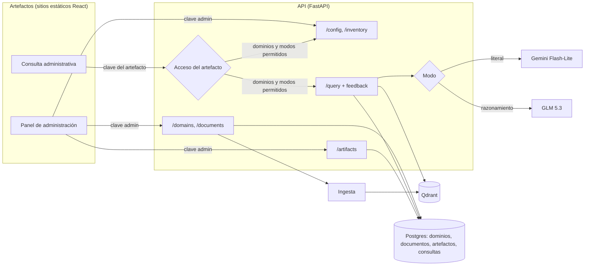

# MIA: Definición de Requerimientos de la Versión 2

**Qué es este documento:** requerimientos de la segunda versión de MIA, que agrega los dos primeros artefactos reales sobre la API del MVP: un **panel de administración** para gestionar la información cargada (dominios y documentos) y la configuración de acceso de cada artefacto, y un **cliente de consulta para el personal administrativo** que permite elegir dominios y modo de respuesta (literal o con razonamiento). Parte del estado descrito en [Definicion_Requerimientos_MVP.md](Definicion_Requerimientos_MVP.md) y [ARQUITECTURA.md](ARQUITECTURA.md). Redactado el 2026-10-06 y actualizado el 2026-10-07 (el inventario pasa a ser un módulo del panel de administración); las decisiones abiertas están en la sección 9.

## 1. Alcance

| Decisión | Elegido | Por qué |
|---|---|---|
| Artefactos | Dos aplicaciones web separadas: Panel de administración y Consulta administrativa | Tienen usuarios y permisos distintos (administrar vs. consultar), que es justamente la idea de "artefacto" del documento conceptual. |
| Panel de administración | Un solo artefacto de gestión, organizado en módulos: Inventario de información y Artefactos y accesos | Toda la configuración de MIA se hace desde un mismo lugar. Un tipo de configuración nuevo (topes de gasto, usuarios, parámetros de búsqueda) se agrega como un módulo más, sin crear otro artefacto. |
| Acceso de los artefactos | Cada artefacto se registra en el panel con su propia clave, los dominios que puede consultar y los modos de respuesta que puede usar | La Consulta administrativa accede a todo, pero un futuro chatbot web debe ver solo la información pertinente a su público y usar solo los modos más baratos. La restricción la aplica la API, no el artefacto. |
| Tecnología de los artefactos | React + TypeScript + Vite, publicadas como sitios estáticos | Pedido explícito para el panel; se usa lo mismo en ambos para compartir el cliente de la API. Un sitio estático se publica gratis (Render Static Sites, Vercel). |
| Modos de respuesta | **Literal** (Gemini Flash-Lite, sin razonamiento) y **Con razonamiento** (GLM 5.3) | Dos necesidades distintas: una respuesta fiel al texto de los documentos, o una inferencia que combine datos (sumar, comparar, contar). |
| Elección del modo | La API expone modos, no proveedores | Los artefactos piden "literal" o "razonamiento"; qué modelo hay detrás se configura en la API. Cambiar de modelo no obliga a cambiar los artefactos (mismo principio de piezas intercambiables del MVP). |
| Cliente web actual (`web/`) | Lo reemplaza la Consulta administrativa | La nueva versión hace todo lo que hace el cliente actual, más la elección de modo. |

## 2. Artefacto 1: Panel de administración

### 2.1 Propósito y usuarios

Gestionar MIA sin usar Swagger: qué información tiene cargada y qué puede hacer cada artefacto con ella. Lo usa quien opera el sistema (hoy el desarrollador; a futuro, alguien de Coordinación o Asistencia Administrativa), con la clave de administración.

El panel se organiza en módulos, cada uno una sección con su entrada en el menú lateral:

| Módulo | Qué gestiona | Requerimientos |
|---|---|---|
| Inventario de información | Dominios y documentos | 2.2 a 2.4 |
| Artefactos y accesos | Artefactos registrados, sus claves, dominios y modos permitidos | 2.5 y 2.6 |

Requerimientos comunes a todo el panel:

| Id | Requerimiento |
|---|---|
| ADM-1 | Pedir la clave de administración la primera vez y recordarla en el navegador. Sin una clave válida se puede ver el inventario, pero no crear, subir ni ver o cambiar la configuración de artefactos. |
| ADM-2 | Navegar entre módulos con un menú lateral (en celular, desplegable). Al abrir el panel se muestra el Inventario. |
| ADM-3 | Un módulo nuevo se agrega como una sección más del menú y un grupo de rutas nuevo en la API, sin cambiar los módulos existentes. |

### 2.2 Módulo Inventario de información: requerimientos funcionales

Ver y administrar qué dominios existen, qué documentos tiene cada uno y en qué estado están, y agregar dominios y documentos nuevos.

| Id | Requerimiento |
|---|---|
| INV-1 | Mostrar el inventario como un árbol de directorios: dominios como carpetas y documentos como archivos (ver 2.3). Cada dominio muestra su descripción y cantidad de documentos; cada documento, su tipo (PDF, DOCX, TXT), fecha de carga y estado. |
| INV-2 | Expandir y contraer cada dominio. Al abrir la página se ven todos los dominios contraídos. |
| INV-3 | Crear un dominio nuevo con nombre y descripción. Si el nombre ya existe, mostrar el error sin perder lo escrito. |
| INV-4 | Agregar uno o varios documentos a un dominio, eligiendo archivos o arrastrándolos sobre la carpeta del dominio. Solo se aceptan PDF, DOCX y TXT; los demás se rechazan con un mensaje antes de subirlos. |
| INV-5 | Mostrar el avance de cada documento: en cola, procesando, listo o error. El estado se actualiza solo, sin recargar la página, hasta que el documento queda listo o en error. |
| INV-6 | Si se sube un archivo que ya está en ese dominio, avisar que ya existía, en vez de mostrarlo como nuevo. |
| INV-7 | Si la instancia de la API tiene la carga de documentos desactivada (como Render free), mostrar el árbol en modo solo lectura, con los botones de agregar deshabilitados y un aviso que explique por qué. |
| INV-8 | Crear y subir exige la clave de administración (ADM-1). |
| INV-9 | Buscar en el árbol por nombre de dominio o de documento. |
| INV-10 | Al crear un dominio, recordar que los artefactos con dominios elegidos uno a uno no lo verán hasta habilitarlo en el módulo Artefactos y accesos (los que tienen "todos los dominios" lo ven de inmediato, ver ART-3). |

### 2.3 Vista de árbol (boceto)

```
Inventario de información                           [ Buscar... ]  [ + Nuevo dominio ]

v Memoria del Consejo  (3 documentos)               Actas del Consejo Institucional
    acta-aprobada-3436.pdf      PDF   2026-09-27    listo
    acta-aprobada-3437.pdf      PDF   2026-09-27    listo
    acta-aprobada-3438.pdf      PDF   2026-09-27    procesando...
    [ + Agregar documentos ]
> Currículum  (4 documentos)                        Programas de curso de la Maestría en Computación
> Apertura de promoción  (0 documentos)
```

Si se adopta el nivel de **tipo de fuente** (decisión 9.1), el árbol suma un nivel intermedio, que es la organización descrita en el documento conceptual:

```
v Currículum
    v Programas de curso
        MC6004-Sistemas Operativos Avanzados.pdf    listo
    > Documento constitutivo de la maestría
```

### 2.4 Inventario: fuera de alcance de esta versión

Borrar o renombrar dominios y documentos, reintentar un documento en error, mover documentos entre dominios y ver el contenido de un documento. Borrar exige limpiar también sus fragmentos en Qdrant, y reintentar exige conservar el archivo original, que hoy no se guarda en un almacenamiento persistente (ver [ESCALABILIDAD.md](ESCALABILIDAD.md)).

### 2.5 Módulo Artefactos y accesos: requerimientos funcionales

Un **artefacto** es cualquier aplicación que consulta a MIA (la Consulta administrativa, un futuro chatbot web para estudiantes). Cada uno se registra en este módulo y recibe su propia clave de consulta; con esa clave la API sabe qué artefacto pregunta y le aplica su configuración de acceso. El panel de administración no es un artefacto registrado: usa la clave de administración.

| Id | Requerimiento |
|---|---|
| ART-1 | Listar los artefactos registrados con su nombre, descripción, estado (activo o desactivado), dominios y modos permitidos, y cantidad de consultas de los últimos 7 días. |
| ART-2 | Registrar un artefacto nuevo con nombre (único) y descripción. Al crearlo, la API genera su clave y el panel la muestra **una sola vez**, con un botón para copiarla; después solo se ve su comienzo (p. ej. `mia_k3f9...`). |
| ART-3 | Elegir los **dominios** que puede consultar: "todos los dominios" (incluye los que se creen después) o una lista elegida uno a uno de los dominios existentes. Debe tener al menos uno. |
| ART-4 | Elegir los **modos de respuesta** que puede usar (literal, con razonamiento, ver 3.3). Debe tener al menos uno. Junto a cada modo se indica su costo aproximado por consulta, para decidir con ese dato. |
| ART-5 | Los cambios de dominios y modos rigen desde la consulta siguiente, sin reiniciar la API ni volver a publicar el artefacto. |
| ART-6 | Regenerar la clave de un artefacto (si se filtró o se publicó por error): la anterior deja de funcionar de inmediato y la nueva se muestra una sola vez, como en ART-2. |
| ART-7 | Desactivar y reactivar un artefacto. Desactivado, sus consultas responden 403 con un mensaje que lo explica; su configuración y su registro de consultas se conservan. |

Ejemplos de configuración:

| Artefacto | Dominios | Modos | Por qué |
|---|---|---|---|
| Consulta administrativa | Todos los dominios | Literal y con razonamiento | Lo usa el personal administrativo, que necesita toda la información y preguntas que combinan datos. |
| Chatbot web (futuro) | Currículum, Apertura de promoción | Literal | Solo la información pertinente para estudiantes (no las actas del Consejo) y solo el modo más barato, para ahorrar tokens. |

**Cómo lo aplica la API:** la configuración vive en la base (tabla de artefactos) y la API la aplica en cada consulta, no el artefacto, porque el código de un sitio estático se puede modificar. Con la clave de un artefacto:

- `GET /domains` devuelve solo los dominios permitidos, y `GET /config` solo los modos permitidos, así el artefacto muestra únicamente lo que puede usar.
- `POST /query` responde 403 si pide un dominio o un modo no permitido.
- Cada consulta queda registrada con el artefacto que la hizo (sección 4), lo que permite medir el uso de cada uno.

### 2.6 Boceto del módulo

```
Panel de administración de MIA

  Inventario            Artefactos y accesos                       [ + Nuevo artefacto ]
> Artefactos y accesos
                        Consulta administrativa        activo     mia_k3f9...   212 consultas (7 días)
                          Dominios: todos
                          Modos:    [x] Literal  [x] Con razonamiento
                          [ Editar ]  [ Regenerar clave ]  [ Desactivar ]

                        Chatbot web                    activo     mia_p81c...    0 consultas (7 días)
                          Dominios: Currículum, Apertura de promoción
                          Modos:    [x] Literal  [ ] Con razonamiento
                          [ Editar ]  [ Regenerar clave ]  [ Desactivar ]
```

**Configuraciones futuras:** si más adelante se configura algo más por artefacto (un tope diario de consultas o de gasto propio, el número de fragmentos recuperados, la instrucción al modelo, usuarios con acceso), se agrega como un campo más del artefacto en este módulo; si es una configuración global de MIA, como un módulo nuevo del panel (ADM-3).

## 3. Artefacto 2: Consulta administrativa

### 3.1 Propósito y usuarios

Cliente de consulta para el personal administrativo (Coordinación y Asistencia Administrativa): preguntar en lenguaje natural sobre los dominios elegidos y decidir si se quiere una respuesta literal o una con razonamiento. Es también el artefacto con el que se hará la evaluación con usuarios (objetivo específico 5).

### 3.2 Requerimientos funcionales

| Id | Requerimiento |
|---|---|
| CON-1 | Mostrar los dominios que el artefacto tiene permitidos (ART-3; para la Consulta administrativa, todos) con una casilla para seleccionarlos o deseleccionarlos, más "todos" y "ninguno". No se puede preguntar sin al menos un dominio seleccionado. La selección se recuerda en el navegador. |
| CON-2 | Elegir el modo de respuesta antes de cada pregunta, entre los que el artefacto tiene permitidos (ART-4): **Literal** o **Con razonamiento** (ver 3.3), con una explicación corta de cada uno junto al selector. El modo elegido se recuerda. Si solo tiene un modo permitido, no se muestra el selector. |
| CON-3 | Si la API no tiene configurado el modo con razonamiento, o ya se alcanzó su tope diario (sección 5), mostrar esa opción deshabilitada y el motivo. Un modo no permitido para el artefacto no se muestra. |
| CON-4 | Mostrar las respuestas como conversación, con formato (negritas y listas) y, debajo de cada una, las fuentes citadas (dominio y documento) con los fragmentos desplegables. |
| CON-5 | Indicar en cada respuesta con qué modo se generó y cuánto tardó. Mientras espera, mostrar que está trabajando; en modo con razonamiento, avisar que puede tardar más. |
| CON-6 | Distinguir visualmente la respuesta "sin información suficiente" del resto. |
| CON-7 | Ante un error (LLM saturado, sin conexión, tope alcanzado), mostrar un mensaje claro y un botón para reintentar, y en el caso del razonamiento ofrecer reintentar en modo literal. |
| CON-8 | Calificar cada respuesta como útil o no útil, con un comentario opcional. Es el insumo para las métricas de la evaluación con usuarios, hoy pendientes. |
| CON-9 | Pedir la clave de consulta la primera vez y recordarla en el navegador. Es la clave del artefacto Consulta administrativa, generada en el panel (ART-2). |

Cada pregunta se responde por separado: el sistema no recuerda las preguntas anteriores de la conversación (ver sección 10).

### 3.3 Modos de respuesta

| | Literal | Con razonamiento |
|---|---|---|
| Para qué | Saber qué dice exactamente un documento: un acuerdo, un requisito, una fecha. | Preguntas que combinan datos: sumar créditos de varios cursos, comparar horas entre programas, contar acuerdos sobre un tema. |
| Modelo | Gemini Flash-Lite (`gemini-3.5-flash-lite`, plan gratuito) | GLM 5.3 (Z.ai, de pago) con razonamiento activado |
| Instrucción al modelo | La actual: responder solo con lo que dicen los fragmentos, citando lo más textual posible. | Puede combinar, comparar y calcular a partir de los fragmentos. Debe mostrar los datos que usó (p. ej. "4 + 4 + 4 = 12") y separar lo que dice el documento de lo que infiere. Sigue sin usar conocimiento externo. |
| Fragmentos recuperados | 8 resultados más vecinos (como hoy) | Más resultados (p. ej. 16), para que entren datos de más documentos. |
| Tiempo esperado | Segundos | Decenas de segundos |
| Costo por consulta | 0 (plan gratuito, con cuota diaria) | Unos 0.02 USD con el volumen de contexto actual |

Limitación conocida: el modo con razonamiento mejora lo que el modelo hace con los fragmentos, pero no cambia qué fragmentos llegan. Una pregunta sobre "todos los cursos" sigue dependiendo de que la búsqueda traiga datos de todos, y hoy no lo hace (prueba del 2026-10-06 en [ESCALABILIDAD.md](ESCALABILIDAD.md)). Resolverlo queda para la versión 3 (sección 10).

## 4. Cambios en la API

| Método | Ruta | Cambio | Para |
|---|---|---|---|
| `GET` | `/config` | **Nuevo.** Informa qué puede hacer la instancia: si la carga de documentos está activa y qué modos de respuesta hay disponibles (con su nombre, descripción y si alcanzaron el tope del día). Con la clave de un artefacto, solo los modos que tiene permitidos. | INV-7, CON-3, ART-4 |
| `GET` | `/inventory` | **Nuevo.** Devuelve todos los dominios con sus documentos (y tipo de fuente, si se adopta) en una sola llamada, para armar el árbol sin pedir dominio por dominio. | INV-1 |
| `GET` | `/domains` | Con la clave de un artefacto, devuelve solo sus dominios permitidos. | CON-1, ART-3 |
| `POST` | `/domains` | Exige la clave de administración. Devuelve 409 si el nombre ya existe (hoy falla con un error genérico de la base). | INV-3, ADM-1 |
| `POST` | `/domains/{id}/documents` | Exige la clave de administración. Indica en la respuesta si el documento ya existía. Límite de tamaño de archivo (p. ej. 25 MB). | INV-4, INV-6, ADM-1 |
| `GET` | `/domains/{id}/documents` | Sin cambios; se usa para actualizar el estado de los documentos en proceso. | INV-5 |
| `GET` | `/artifacts` | **Nuevo.** Lista los artefactos con su configuración y uso de los últimos 7 días (nunca la clave). Exige la clave de administración. | ART-1 |
| `POST` | `/artifacts` | **Nuevo.** Registra un artefacto y devuelve su clave, por única vez. 409 si el nombre ya existe. Exige la clave de administración. | ART-2 |
| `PATCH` | `/artifacts/{id}` | **Nuevo.** Cambia descripción, dominios, modos o estado (activo o desactivado). Exige la clave de administración. | ART-3, ART-4, ART-5, ART-7 |
| `POST` | `/artifacts/{id}/key` | **Nuevo.** Regenera la clave y la devuelve por única vez. Exige la clave de administración. | ART-6 |
| `POST` | `/query` | Recibe el modo (`literal` por defecto, o `razonamiento`). Exige la clave de un artefacto activo. Devuelve 403 si pide un dominio o un modo que el artefacto no tiene permitido. Devuelve además un identificador de la consulta, el modo usado y el tiempo de respuesta. Devuelve 429 si el modo con razonamiento alcanzó su tope diario. | CON-2, CON-5, CON-9, ART-3, ART-4 |
| `POST` | `/query/{id}/feedback` | **Nuevo.** Guarda la calificación (útil o no útil) y el comentario. | CON-8 |

**Registro de consultas:** cada consulta se guarda (artefacto, pregunta, dominios, modo, si respondió "sin información", tiempo, calificación) en una tabla nueva. Da la base para las métricas de la evaluación con usuarios, para el uso por artefacto (ART-1) y para controlar el tope diario. Las preguntas se guardan bajo las mismas condiciones que los documentos con datos personales (ver [OPERACION.md](OPERACION.md)).

**Tablas nuevas:** `artifacts` (nombre, descripción, hash de la clave, activo, todos los dominios sí o no, modos permitidos), `artifact_domains` (dominios elegidos uno a uno) y `queries` (registro de consultas). Al ser tablas nuevas, `create_all` las crea sin migraciones; la columna de tipo de fuente (decisión 9.1) sí necesitaría una.

## 5. Requerimientos no funcionales

- **Claves de acceso:** la clave de administración se configura por variable de entorno en la API (`ADMIN_KEY`), porque es la que permite registrar todo lo demás. Las claves de consulta son una por artefacto, las genera la API (ART-2) y se guardan solo como hash, igual que una contraseña: si se pierde, se regenera. Los artefactos las piden a la persona usuaria y las envían en un encabezado; no van escritas en el código publicado, porque cualquiera puede leer el código de un sitio estático. Es un control mínimo, no un sistema de usuarios (ver sección 10).
- **Tope de gasto del modo con razonamiento:** máximo de consultas con razonamiento por día, configurable en la API (p. ej. 50, unos 1 USD diarios con GLM). Al alcanzarlo, ese modo responde 429 y el literal sigue funcionando. Es un tope propio, independiente del que ofrezca Z.ai, porque el prototipo no admite cobros variables sin límite.
- **CORS:** la API debe aceptar peticiones de los dominios donde se publiquen los artefactos (hoy no tiene CORS y el cliente actual depende del proxy de Vite en desarrollo).
- **Tiempo de espera:** los artefactos esperan hasta 200 s antes de dar una respuesta por perdida (Render dormido más razonamiento). La subida de documentos no bloquea la interfaz: el archivo queda en cola y el estado se consulta aparte.
- **Sin cambios en el pipeline de ingesta ni en Qdrant:** los artefactos solo usan la API, y la restricción de dominios reutiliza el filtro por dominio que ya tiene la búsqueda. Un dominio creado desde el panel aparece en la consulta sin reiniciar nada (en los artefactos con "todos los dominios").
- **Idioma y accesibilidad:** interfaz en español, utilizable en pantalla de computadora y de celular, con modo oscuro (como el cliente actual).
- **Pruebas:** tests de la API para cada endpoint nuevo o modificado; `scripts/pruebas_mvp.py` acepta el modo y sigue dando 18 de 18 en modo literal.

## 6. Arquitectura



La API mantiene un proveedor de LLM por modo, configurado por variables de entorno (`LLM_PROVIDER_LITERAL=gemini`, `LLM_PROVIDER_RAZONAMIENTO=glm`), en lugar del único `LLM_PROVIDER` actual. Cada modo tiene su propia instrucción al modelo y su cantidad de fragmentos.

## 7. Stack y despliegue

- **Artefactos:** React + TypeScript + Vite, en `web/admin/` (Panel de administración) y `web/consulta/`, con el cliente de la API compartido entre ambos. La Consulta administrativa reemplaza al cliente actual de `web/`.
- **Publicación:** sitios estáticos gratuitos (Render Static Sites o Vercel), apuntando a la URL de la API.
- **API:** en Railway Hobby con OpenRouter (decisión 9.2, [OPERACION.md](OPERACION.md)). Contra una instancia con la carga desactivada (como Render free), el inventario se usa en modo lectura.

## 8. Criterios de aceptación

1. Desde el panel se crea un dominio nuevo y aparece en el árbol y en la Consulta administrativa (configurada con "todos los dominios") sin reiniciar la API.
2. Contra una instancia con carga activa, se suben dos documentos a ese dominio; su estado avanza solo hasta "listo", y una pregunta sobre su contenido se responde citándolos.
3. Subir de nuevo uno de esos archivos avisa que ya existía y no duplica fragmentos.
4. Contra Render (carga desactivada), el árbol se ve completo y los botones de agregar aparecen deshabilitados con su explicación.
5. Crear un dominio, subir un documento o ver o cambiar artefactos sin la clave de administración responde 401; consultar sin la clave de un artefacto también.
6. En modo literal, `scripts/pruebas_mvp.py` da 18 de 18.
7. En modo con razonamiento, "¿Cuántos créditos suman Sistemas Operativos Avanzados, Análisis de Algoritmos y Diseño de Experimentos?" responde 12, mostrando los créditos de cada curso y citando los tres programas.
8. Al alcanzar el tope diario, el modo con razonamiento queda deshabilitado en la Consulta, la API responde 429 y el modo literal sigue funcionando.
9. Sin clave de GLM configurada, el modo con razonamiento aparece deshabilitado con su motivo.
10. Una calificación de útil o no útil queda guardada junto a su consulta.
11. Se registra un artefacto de prueba con un solo dominio y solo el modo literal: con su clave, `GET /domains` devuelve solo ese dominio, `GET /config` solo el modo literal, y una consulta a otro dominio o en modo con razonamiento responde 403.
12. Al regenerar la clave de un artefacto, la anterior responde 401 y la nueva funciona; al desactivarlo, sus consultas responden 403, y al reactivarlo vuelven a funcionar con la misma configuración.
13. Un cambio de dominios o modos hecho en el panel rige en la consulta siguiente del artefacto, sin reiniciar la API.

## 9. Decisiones pendientes

1. **Nivel de tipo de fuente en el árbol** (p. ej. Currículum > Programas de curso > documento). Recomendado: sí, como un campo opcional del documento, porque es la organización del documento conceptual y la de las carpetas de prueba. Requiere agregar una columna en la base de Neon; como no hay migraciones, conviene incorporar Alembic en esta versión (ya estaba pendiente en ESCALABILIDAD.md).
2. ~~**Dónde se cargan documentos.**~~ Resuelto el 2026-10-07: en el servidor. La API pasa a Railway Hobby (5 USD al mes, sin el límite de 512 MB de Render free), así que el inventario puede cargar documentos en producción y lo puede usar el personal, no solo quien opera el sistema. Los modelos de los dos modos (literal y con razonamiento) se contratan por OpenRouter. Ver [OPERACION.md](OPERACION.md).
3. **Una aplicación o dos.** Este documento propone dos sitios separados. Alternativa: una sola aplicación con dos secciones, más simple de publicar pero que mezcla los permisos de administrar y de consultar. Con el registro de artefactos (2.5) se refuerza la separación: el panel configura a los artefactos de consulta, y no es uno de ellos.
4. **Tope diario: global o por artefacto.** La sección 5 define un tope diario del modo con razonamiento para toda la API. Si se registran varios artefactos, uno podría agotar el tope de los demás. Recomendado: global en esta versión (hay un solo artefacto de consulta) y por artefacto como primera configuración futura del módulo Artefactos y accesos (2.6).

## 10. Fuera de la versión 2 (candidatos para la versión 3)

- **Preguntas de agregación sobre todo un dominio** ("todos los cursos"): recuperación con herramientas (el modelo decide qué buscar) o datos estructurados extraídos al cargar (créditos, horas, requisitos).
- **Memoria de conversación:** preguntas de seguimiento que se apoyen en las anteriores.
- **Usuarios individuales:** cuentas con su propia identidad dentro de un artefacto (hoy los permisos son por artefacto, ver 2.5, y todas las personas que usan un artefacto comparten su clave). Se agregarían como un módulo más del panel de administración.
- **Administración completa del inventario:** borrar, renombrar, mover y reintentar documentos, con los archivos originales en almacenamiento persistente.
- **Nuevas fuentes:** CSV, XLSX y páginas web (ACM, repositorio Orion).
