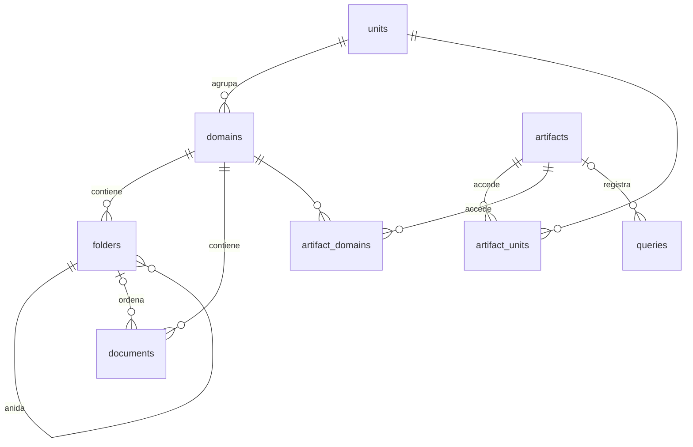

# Data Model: Panel de administración de MIA

Base de metadatos SQL (SQLite en desarrollo, Postgres en producción), con migraciones Alembic
([research.md](research.md), decisiones 1 y 2). Los ids son UUID en texto, como hoy. Las fechas se
guardan en UTC. Qdrant no cambia de estructura: cada fragmento sigue teniendo `domain` (id del dominio),
`document_id` y `chunk_index` en su payload.

## Diagrama

## Tablas nuevas

### units (unidad académica)

| Campo | Tipo | Reglas |
|---|---|---|
| id | texto (UUID) | PK |
| name | texto | obligatorio, único |
| description | texto | por defecto "" |
| created_at | fecha y hora | por defecto ahora |

### folders (carpeta)

| Campo | Tipo | Reglas |
|---|---|---|
| id | texto (UUID) | PK |
| domain_id | texto | FK `domains.id`, obligatorio |
| parent_id | texto | FK `folders.id`, nulo si está en la raíz del dominio |
| name | texto | obligatorio; único entre las carpetas del mismo padre en el mismo dominio |
| created_at | fecha y hora | por defecto ahora |

- La unicidad se verifica en la API (en SQL, `NULL` en `parent_id` no participa de una restricción
  única), además de un índice único `(domain_id, parent_id, name)` para los niveles no raíz.
- `parent_id`, si existe, debe pertenecer al mismo `domain_id`.
- Solo se borra si no tiene documentos ni subcarpetas (409 si no).

### artifacts (artefacto de consulta)

| Campo | Tipo | Reglas |
|---|---|---|
| id | texto (UUID) | PK |
| name | texto | obligatorio, único |
| description | texto | por defecto "" |
| key_hash | texto | SHA-256 de la clave, único e indexado |
| key_prefix | texto | primeros 8 caracteres de la clave, para mostrar |
| active | booleano | por defecto verdadero |
| all_domains | booleano | por defecto falso; si es verdadero incluye unidades futuras |
| modes | texto | lista separada por comas de `literal` y `razonamiento`; al menos uno |
| daily_cap_usd | decimal | obligatorio, mayor que 0; por defecto 0.50 |
| reasoning_daily_cap_usd | decimal | opcional; si existe, mayor que 0 y menor o igual que `daily_cap_usd` |
| created_at, updated_at | fecha y hora | |

Regla: un artefacto debe tener acceso a al menos un dominio: `all_domains`, o al menos una fila en
`artifact_units` o en `artifact_domains`.

### artifact_units y artifact_domains (acceso)

| Tabla | Campos | Reglas |
|---|---|---|
| artifact_units | artifact_id (FK), unit_id (FK) | PK compuesta; acceso a toda la unidad, incluidos sus dominios futuros |
| artifact_domains | artifact_id (FK), domain_id (FK) | PK compuesta; acceso a un dominio puntual |

**Dominios permitidos de un artefacto** = todos los dominios si `all_domains`; si no, los dominios de
sus unidades más sus dominios puntuales (sin duplicados). Se calcula en cada consulta, así que un
dominio nuevo de una unidad permitida queda visible de inmediato (ART-3, ART-5).

### queries (registro de consultas)

| Campo | Tipo | Reglas |
|---|---|---|
| id | texto (UUID) | PK |
| created_at | fecha y hora (UTC) | indexado junto con `artifact_id` |
| artifact_id | texto | FK `artifacts.id`; nulo solo si la clave no correspondía a ningún artefacto |
| question | texto | |
| domain_ids | texto (JSON) | lista de ids pedidos |
| mode | texto | `literal` o `razonamiento` |
| model | texto | id del modelo que respondió; nulo si no llegó al modelo |
| prompt_tokens, completion_tokens, reasoning_tokens | entero | nulos si el proveedor no los informa |
| cost_usd | decimal | 0 si no llegó al modelo |
| cost_estimated | booleano | verdadero si el costo se calculó con precios de respaldo |
| latency_ms | entero | tiempo total de la consulta |
| outcome | texto | ver estados abajo |
| reject_reason | texto | motivo cuando `outcome` es `rejected_*` o `error` |
| sources | texto (JSON) | lista de `{domain, document}` citados |
| rating | texto | `util`, `no_util` o nulo |
| rating_comment | texto | opcional |

**Resultado (`outcome`)**:

| Valor | Cuándo |
|---|---|
| `answered` | respondió con fuentes |
| `no_info` | respondió "sin información suficiente" |
| `error` | falló el proveedor de LLM (502) |
| `rejected_cap` | rechazada por tope (429): `reject_reason` indica cuál (artefacto, modo o API) |
| `rejected_permission` | rechazada por permisos (403): dominio o modo no permitido, o artefacto desactivado |

Las consultas sin clave o con clave inválida (401) no se registran: no hay artefacto al que
atribuirlas y registrarlas permitiría llenar la tabla sin autenticarse.

## Tablas existentes que cambian

### domains

| Cambio | Detalle |
|---|---|
| + `unit_id` | FK `units.id`, nullable en la base (research, decisión 2); obligatorio al crear por la API |
| unicidad | se reemplaza `name` único por `(unit_id, name)` único |

### documents

| Cambio | Detalle |
|---|---|
| + `folder_id` | FK `folders.id`, nullable (documento en la raíz del dominio) |

La detección de duplicados (INV-6) sigue siendo por `(domain_id, file_hash)`, sin importar la carpeta.
Estados del documento sin cambios: `pending` (en cola) → `processing` → `done` o `error`.

## Modos de respuesta (configuración, no tabla)

| Modo | Id | Configuración |
|---|---|---|
| Literal | `literal` | `LLM_PROVIDER_LITERAL`, `LLM_MODEL_LITERAL`, `LLM_REASONING_EFFORT_LITERAL`, `LLM_PRICE_IN_LITERAL`, `LLM_PRICE_OUT_LITERAL` (si faltan, los valores actuales de `LLM_PROVIDER` y `OPENROUTER_*`) |
| Con razonamiento | `razonamiento` | Las mismas variables con sufijo `_RAZONAMIENTO`; sin proveedor configurado, el modo figura como no disponible |

## Configuración nueva de la instancia

| Variable | Uso | Por defecto |
|---|---|---|
| `ADMIN_KEY` | clave de administración | vacía (operaciones de administración responden 503) |
| `DAILY_CAP_USD` | tope diario de toda la API | 3.0 |
| `CAP_TIMEZONE` | zona horaria del día de los topes | `America/Costa_Rica` |
| `CORS_ORIGINS` | orígenes permitidos, separados por comas | vacía |
| `MAX_UPLOAD_MB` | tamaño máximo por archivo | 25 |
| `OPENROUTER_MANAGEMENT_KEY` | opcional, para leer el saldo de toda la cuenta | vacía |
